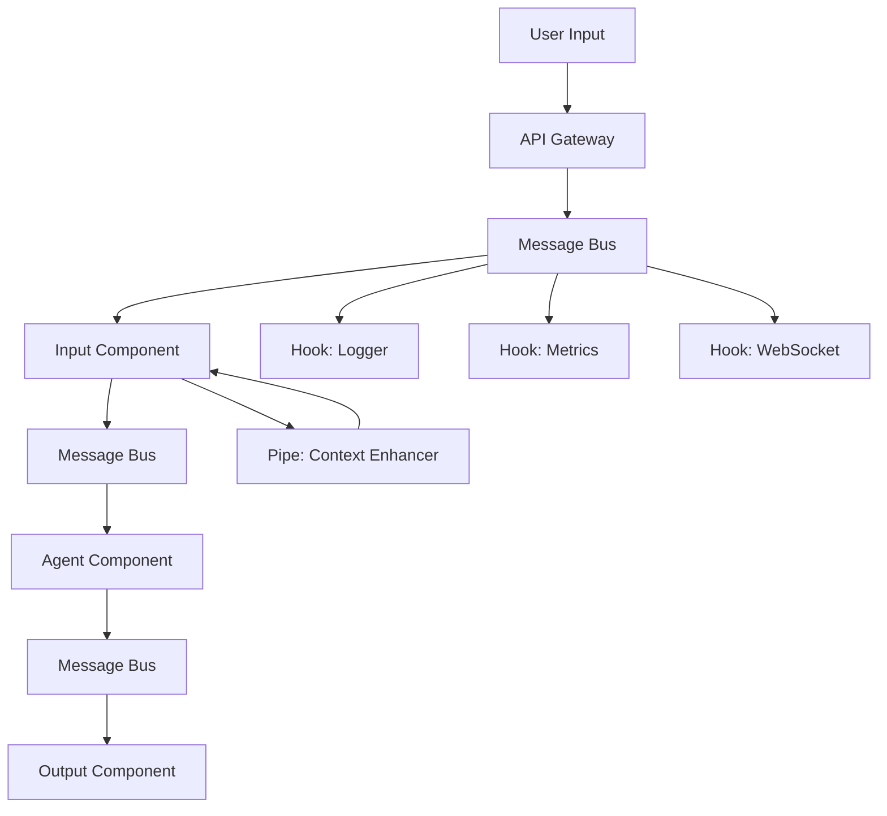

# Woodwork Engine - Microservices Architecture Design

## Executive Summary

This document outlines the evolution of the Woodwork Engine to a distributed, microservices-based, event-driven system. The new architecture will enable component isolation, horizontal scaling, streaming data processing, and true decoupling while supporting both local development and enterprise cloud deployments with integrated metrics and monitoring.

## Current Architecture Analysis

### Existing Components
- **Task Master**: Central orchestrator managing component lifecycle and message routing
- **Components**: LLMs, agents, inputs, outputs, knowledge bases, APIs - tightly coupled through direct method calls
- **Event System**: Recently implemented typed event system with hooks, pipes, and events
- **Deployment Layer**: Basic abstractions for local vs server deployment (ServerDeployment, LocalDeployment)
- **Router**: Simple component registry with HTTP fallback for remote components

### Current Limitations
1. **Single Point of Failure**: Task Master manages everything centrally
2. **Tight Coupling**: Components communicate through direct method calls
3. **No Horizontal Scaling**: All components run in single process/thread
4. **Cross-thread Issues**: Event loops between TaskMaster thread and other components cause timing problems
5. **Limited Isolation**: Components share memory space and can interfere with each other
6. **No Streaming Support**: Current data types don't support efficient streaming between components
7. **No Enterprise Metrics**: No built-in metrics collection for monitoring and analytics

## Proposed Architecture Overview

### Core Principles
1. **Component Isolation**: Each component runs in its own container/process
2. **Event-Driven Communication**: All inter-component communication via message queues with streaming support
3. **Synchronous Processing Chain**: Input → Agent → Output flows processed sequentially
4. **Asynchronous Hooks**: Side-effects (logging, monitoring) processed concurrently  
5. **Session-Based Multi-tenancy**: Support multiple concurrent user workflows
6. **Horizontal Scalability**: Components can scale independently based on load
7. **Local/Cloud Parity**: Same architecture works locally (development) and in cloud (production)
8. **Enterprise-Ready Metrics**: Built-in metrics emission with optional enterprise ingestion
9. **Streaming-First**: Support for real-time data streaming between components

### Architecture Components

#### 1. Message Bus / Event Router
- **Purpose**: Central nervous system for event routing and delivery
- **Technology Options**:
  - **Local**: Redis (embedded/container) or in-memory message queue
  - **Cloud**: Redis Streams, NATS Jetstream, or Apache Kafka
- **Responsibilities**:
  - Route events between components based on session ID and event type
  - Support streaming data with backpressure handling
  - Guarantee message delivery and ordering within sessions
  - Handle dead letter queues for failed messages
  - Provide event replay capabilities for debugging
  - Enable local development without external dependencies

#### 2. Component Containers
- **Purpose**: Isolated execution environment for each component
- **Technology**: Docker containers with standardized interfaces
- **Structure**:
  ```
  woodwork-component/
  ├── Dockerfile            # Generated by `woodwork build`
  ├── component.py          # Main component logic
  ├── event_handler.py      # Event processing logic  
  ├── streaming_handler.py  # Stream processing logic
  ├── pipes/               # Bundled pipe functions (initially)
  ├── metrics_emitter.py   # Enterprise metrics emission
  └── requirements.txt
  ```
- **Standard Interface**:
  - Event consumption from message bus with streaming support
  - Event emission to message bus with streaming support  
  - Health check endpoint (`/health`)
  - Metrics endpoint (`/metrics`) 
  - Enterprise metrics emission (OSS core, enterprise ingestion)
  - Stream processing with backpressure handling

#### 3. Session Manager
- **Purpose**: Track user sessions and workflow state
- **Technology**: Redis or distributed cache
- **Responsibilities**:
  - Generate unique session IDs
  - Track workflow progress and component chain
  - Handle session timeouts and cleanup
  - Route events to appropriate component instances

#### 4. Component Registry & Discovery
- **Purpose**: Service discovery and component metadata management
- **Technology**: Consul, etcd, or Kubernetes service discovery
- **Responsibilities**:
  - Register component instances and their capabilities
  - Provide component health status
  - Enable dynamic scaling decisions
  - Store component configuration metadata

#### 5. Configuration Orchestrator
- **Purpose**: Parse .ww files and deploy component topology
- **Responsibilities**:
  - Parse .ww configuration files
  - Deploy component containers based on configuration
  - Set up event routing rules
  - Configure pipes and hooks per component

## Detailed Design

### Event Flow Architecture



### Message Structure

#### Standard Event Message
```json
{
  "session_id": "uuid-1234-5678",
  "event_type": "input.received",
  "component_source": "cli_input_001",
  "component_target": "agent_001", 
  "timestamp": "2024-01-01T12:00:00Z",
  "stream_id": "stream-abc-123",
  "is_stream": false,
  "payload": {
    "input": "Hello world",
    "context": {...}
  },
  "routing": {
    "next_component": "agent_001",
    "pipe_chain": ["context_enhancer", "input_validator"]
  }
}
```

#### Stream Data Message
```json
{
  "session_id": "uuid-1234-5678", 
  "event_type": "agent.stream_chunk",
  "component_source": "agent_001",
  "component_target": "output_001",
  "timestamp": "2024-01-01T12:00:00Z",
  "stream_id": "stream-abc-123",
  "is_stream": true,
  "chunk_index": 42,
  "is_final": false,
  "payload": {
    "data": "This is a partial response...",
    "data_type": "text",
    "chunk_size": 1024
  }
}
```

#### Enterprise Metrics Message
```json
{
  "session_id": "uuid-1234-5678",
  "event_type": "metrics.component_performance", 
  "component_source": "agent_001",
  "timestamp": "2024-01-01T12:00:00Z",
  "payload": {
    "processing_time_ms": 245,
    "memory_usage_mb": 128,
    "tokens_processed": 150,
    "cost_estimate": 0.003,
    "custom_metrics": {...}
  }
}
```

### Component Communication Patterns

#### 1. Synchronous Processing Chain
- Components process events sequentially within a session
- Each component emits completion event before next component processes
- Pipes transform payloads synchronously before event emission  
- Supports streaming: chunks flow sequentially maintaining order
- Guarantees workflow order: Input → Agent → Output

#### 2. Streaming Data Flow
- Components can emit streaming responses (e.g., LLM token streams)
- Stream chunks processed in order with `chunk_index` for reliability
- Receiving components can start processing before stream completion
- Backpressure handling prevents memory overflow
- Final chunk marked with `is_final: true`

#### 3. Asynchronous Hooks
- Hooks receive copy of all events but don't block processing chain
- Used for logging, metrics, debugging, WebSocket broadcasting
- Support streaming events for real-time monitoring  
- Failed hooks don't affect main workflow
- Enterprise metrics hooks emit to void unless enterprise package activated

#### 4. Session Isolation
- Each session gets independent message queue/topic
- Components can scale but maintain session affinity for stateful operations
- Session state stored in distributed cache
- Stream state tracked per session to handle reconnections

### Deployment Strategies

#### Component Containerization Strategy

**Bundled Component + Pipes Architecture** (Initial Implementation)
```dockerfile
FROM python:3.11-slim
COPY component.py pipes/ streaming_handler.py metrics_emitter.py ./
RUN pip install woodwork-runtime
EXPOSE 8080
CMD ["python", "component.py"]
```
- **Pros**: Simple deployment, fast execution, no network overhead for pipes
- **Cons**: Less granular scaling, pipes share component resources
- **Evolution Path**: Can migrate to serverless pipes later without .ww file changes

#### Deployment Modes

**Development Mode (`woodwork dev`)**
```bash
woodwork dev        # Fast iteration with hot reload
```
- Uses embedded Redis or in-memory message bus
- Hot reload for component code changes  
- Enterprise metrics emitted to void (no ingestion)
- Optimized for fast iteration and debugging
- No container building required

**Local Production Mode (`woodwork build --deploy local`)**
```bash
woodwork build --deploy local --detach
```
- Full containerized stack running locally
- Production-like environment for testing
- Uses Redis container for message bus
- Enterprise metrics can be configured for testing
- Persistent data volumes for stateful components

**Export Mode (`woodwork build --export`)**
```bash
woodwork build --export kubernetes
woodwork build --export helm --values prod-values.yaml  
```
- Generates deployment artifacts only
- Users handle deployment using their preferred tools
- Includes health checks, resource limits, and scaling configurations
- Cloud-ready with configurable parameters

**Future Cloud Mode (`woodwork deploy --target`)**  
```bash
woodwork deploy --target aws --region us-west-2  # Planned feature
```
- Direct cloud deployment with managed infrastructure
- Automatic scaling and load balancing
- Integrated monitoring and alerting
- Enterprise metrics ingestion included

### Scaling and Load Distribution

#### Component Scaling Rules
```yaml
scaling:
  llm_component:
    min_instances: 1
    max_instances: 10
    scale_metric: queue_depth
    scale_threshold: 5
  
  input_component:
    min_instances: 2
    max_instances: 50
    scale_metric: connections
    scale_threshold: 100
```

#### Load Balancing
- Round-robin for stateless components (LLMs)
- Session-affinity for stateful components (memory systems)
- Queue-based load balancing with back-pressure

## Enterprise Metrics & Monitoring Architecture

### Core OSS Metrics Emission
All components in the OSS version include built-in metrics emission:

```python
# metrics_emitter.py (included in every component container)
class MetricsEmitter:
    def emit_performance_metrics(self, processing_time, memory_usage, tokens=None, cost=None):
        metrics_event = {
            "event_type": "metrics.component_performance",
            "component_source": self.component_id,
            "session_id": self.session_id,
            "payload": {
                "processing_time_ms": processing_time,
                "memory_usage_mb": memory_usage,
                "tokens_processed": tokens,
                "cost_estimate": cost,
                "custom_metrics": self.custom_metrics
            }
        }
        
        # Emit to void if no enterprise ingestion
        if not self.enterprise_ingestion_available():
            log.debug("Metrics emitted to void (no enterprise package)")
            return
            
        # Enterprise package handles ingestion
        self.enterprise_client.ingest_metrics(metrics_event)
```

### Enterprise Package Integration
The `woodwork_enterprise` package provides:

1. **Metrics Ingestion**: Collects metrics from all components
2. **Dashboarding Service**: Web-based analytics and monitoring
3. **Alerting**: Performance thresholds and anomaly detection  
4. **Cost Tracking**: Token usage and API cost analytics across sessions
5. **Session Analytics**: User behavior and workflow optimization insights

```python
# woodwork_enterprise package activation
if woodwork_enterprise.is_activated():
    metrics_client = woodwork_enterprise.MetricsClient(api_key=api_key)
    component.set_enterprise_client(metrics_client)
```

## CLI Commands & Build System

### Core Commands
```bash
# Development workflow  
woodwork init           # Initialize new project with .ww template
woodwork build         # Generate Dockerfiles and deployment artifacts
woodwork dev           # Start local development with hot reload
woodwork test          # Run component integration tests

# Build & deployment workflow
woodwork build --output ./build          # Generate containers and configs
woodwork build --deploy local            # Build and deploy locally via docker-compose
woodwork build --export docker-compose   # Export docker-compose.yml only
woodwork build --export kubernetes       # Export k8s manifests only
woodwork build --export helm             # Export Helm charts only

# Future cloud deployment (planned)
woodwork deploy --target aws             # Deploy to AWS (future feature)
woodwork deploy --target gcp             # Deploy to GCP (future feature)
woodwork deploy --target azure           # Deploy to Azure (future feature)
```

### Build System Details

#### `woodwork build` Command
Analyzes .ww configuration and generates containers and deployment artifacts with multiple deployment options:

```bash
# Basic build (containers + all deployment configs)
woodwork build --output ./build --optimize-for production

# Build and deploy locally immediately  
woodwork build --deploy local --detach

# Export specific deployment format only
woodwork build --export kubernetes --namespace my-agents
woodwork build --export helm --values custom-values.yaml
```

Generated structure:
```
build/
├── agent-component/
│   ├── Dockerfile
│   ├── component.py      # Generated wrapper
│   ├── streaming_handler.py
│   ├── metrics_emitter.py  
│   └── pipes/
│       └── context_enhancer.py
├── input-component/
│   ├── Dockerfile
│   └── ...
├── docker-compose.yml    # Local deployment ready
├── kubernetes/           # K8s manifests (if requested)
│   ├── deployments/
│   ├── services/
│   └── configmaps/
├── helm-chart/          # Helm chart (if requested)
│   ├── Chart.yaml
│   ├── values.yaml
│   └── templates/
└── .woodwork-deploy/    # Deployment metadata for future cloud features
    ├── deployment-config.json
    └── cloud-templates/
```

#### Local Deployment Integration
```bash
# Build and run locally in one command
woodwork build --deploy local
# Equivalent to: build + docker-compose up -d

# Stop local deployment
woodwork stop

# View logs from local deployment
woodwork logs --component agent
woodwork logs --follow
```

#### Generated Dockerfile Template
```dockerfile
FROM python:3.11-slim

# Install woodwork runtime
RUN pip install woodwork-runtime

# Copy component-specific code
COPY component.py streaming_handler.py metrics_emitter.py ./
COPY pipes/ ./pipes/

# Install component dependencies
COPY requirements.txt ./
RUN pip install -r requirements.txt

# Health check endpoint
HEALTHCHECK --interval=30s --timeout=3s --start-period=5s --retries=3 \
  CMD curl -f http://localhost:8080/health || exit 1

EXPOSE 8080
CMD ["python", "component.py"]
```

## Streaming Data Architecture

### Enhanced Data Types

```python
# woodwork/types/streaming_data.py
from typing import AsyncGenerator, Optional, Union
from dataclasses import dataclass
import asyncio
import uuid

@dataclass  
class StreamChunk:
    """Individual chunk in a data stream"""
    stream_id: str
    chunk_index: int
    data: Union[str, bytes, dict]
    data_type: str  # "text", "audio", "image", "json"
    is_final: bool = False
    chunk_size: Optional[int] = None
    metadata: dict = None

class StreamManager:
    """Manages streaming data between components"""
    
    def __init__(self, message_bus):
        self.message_bus = message_bus
        self.active_streams = {}
        
    async def create_stream(self, session_id: str, component_source: str, component_target: str) -> str:
        """Create new stream and return stream_id"""
        stream_id = f"stream-{uuid.uuid4()}"
        self.active_streams[stream_id] = {
            "session_id": session_id,
            "source": component_source,
            "target": component_target,
            "chunks_sent": 0,
            "is_complete": False
        }
        return stream_id
        
    async def send_chunk(self, stream_id: str, data: any, is_final: bool = False):
        """Send stream chunk to target component"""
        stream = self.active_streams[stream_id]
        chunk = StreamChunk(
            stream_id=stream_id,
            chunk_index=stream["chunks_sent"],
            data=data,
            data_type=self._detect_data_type(data),
            is_final=is_final
        )
        
        await self.message_bus.publish({
            "session_id": stream["session_id"],
            "event_type": "stream.chunk",
            "component_source": stream["source"],
            "component_target": stream["target"], 
            "stream_id": stream_id,
            "is_stream": True,
            "payload": chunk.__dict__
        })
        
        stream["chunks_sent"] += 1
        if is_final:
            stream["is_complete"] = True
            
    async def receive_stream(self, stream_id: str) -> AsyncGenerator[StreamChunk, None]:
        """Receive stream chunks as async generator"""
        while stream_id in self.active_streams:
            chunk_data = await self.message_bus.receive_stream_chunk(stream_id)
            chunk = StreamChunk(**chunk_data)
            yield chunk
            
            if chunk.is_final:
                break
```

### Component Streaming Integration

```python  
# Example: LLM component with streaming response
class LLMComponent:
    async def process_input(self, input_data):
        stream_id = await self.stream_manager.create_stream(
            session_id=input_data["session_id"],
            component_source=self.component_id,
            component_target="output_component"
        )
        
        # Stream LLM tokens as they arrive
        async for token in self.llm.stream_completion(input_data["prompt"]):
            await self.stream_manager.send_chunk(stream_id, token)
            
        # Send final chunk
        await self.stream_manager.send_chunk(stream_id, "", is_final=True)
```

## Implementation Phases

### Phase 1: Core Infrastructure (Weeks 1-4)
- **Goal**: Build foundational streaming and containerization system
- **Tasks**:
  - Implement streaming data types and StreamManager
  - Create message bus abstraction (local + cloud)
  - Build `woodwork build` command and Dockerfile generation
  - Create basic component containerization framework
  - Implement enterprise metrics emission (OSS core)

### Phase 2: Component Migration (Weeks 5-8)  
- **Goal**: Migrate core components to containerized architecture
- **Tasks**:
  - Containerize input, agent, output components with streaming support
  - Implement session manager and component discovery
  - Create `woodwork dev` local development environment
  - Test end-to-end streaming workflow: CLI → Agent → CLI output
  - Bundle pipes with components initially

### Phase 3: Production Readiness (Weeks 9-12)
- **Goal**: Production build system and enterprise features
- **Tasks**:
  - Implement production-grade `woodwork build` with multiple export formats
  - Create enterprise metrics ingestion client (separate package)
  - Add health checks, resource limits, and monitoring endpoints
  - Generate deployment templates (K8s, Helm, Docker Compose)
  - Performance optimization and documentation

## Technical Considerations & Implementation Notes

### 1. Local vs Cloud Message Bus Strategy
**Local Development**:
- Embedded Redis container (single dependency)
- In-memory queue fallback if Redis unavailable  
- Docker Compose orchestration for multi-component workflows

**Cloud Production**:
- Redis Streams for simplicity and persistence
- NATS Jetstream for high-throughput scenarios
- Kafka for enterprise-scale deployments

### 2. Streaming Data Reliability  
**Chunk Ordering**: Use `chunk_index` to ensure ordered processing
**Reconnection Handling**: Stream state persisted in session manager  
**Backpressure**: Component queues have configurable depth limits
**Error Recovery**: Failed chunks trigger retry with exponential backoff

### 3. Enterprise Metrics Architecture
**OSS Core Principles**:
- All metrics emission code included in OSS
- No external dependencies for metrics emission
- Graceful degradation when enterprise package unavailable
- Zero performance impact when metrics emitted to void

**Enterprise Package Strategy**:
- Separate `woodwork_enterprise` Python package
- Optional dependency activated with API key
- Backwards compatible - works with existing OSS deployments
- Provides metrics ingestion, dashboards, alerting

### 4. Component Discovery & Health Management
**Service Discovery**: 
- Local: Docker network DNS resolution
- Cloud: Kubernetes service discovery or Consul

**Health Monitoring**:
- HTTP `/health` endpoint for each component
- Readiness vs liveness probe separation
- Circuit breaker pattern for failed components  
- Graceful degradation with fallback responses

### 5. Development Experience Optimization
**Fast Feedback Loop**:
- `woodwork build` generates optimized containers in <30s
- `woodwork dev` starts full stack in <60s  
- Hot reload for component code changes
- Integration test suite runs against containerized stack

## .ww Configuration Evolution

### Current vs Future Configuration
**Current .ww** (still supported):
```python
# main.ww
agent = claude {
    model = "claude-3-sonnet"
    pipes = ["pipes.py::context_enhancer"]
    hooks = ["hooks.py::print_thought"]
}

input = cli {}
output = cli {}
```

**Enhanced .ww** (microservices-ready):
```python  
# main.ww  
agent = claude {
    model = "claude-3-sonnet"
    deployment = {
        mode = "container"      # container | local (default: auto)
        scaling = {
            min_instances = 1
            max_instances = 5
            scale_metric = "queue_depth"
        }
        resources = {
            cpu = "500m"
            memory = "1Gi" 
        }
    }
    pipes = ["pipes.py::context_enhancer"]  # bundled in container
    hooks = ["hooks.py::print_thought"]
    metrics = {
        custom_metrics = ["token_count", "response_time"]
        enterprise_enabled = true
    }
}

input = cli {
    deployment = { mode = "container" }
}

output = cli {
    deployment = { mode = "container" }  
}
```

### Migration Path
1. **Phase 1**: Add `deployment.mode = "local"` to maintain current behavior
2. **Phase 2**: Components individually switched to `deployment.mode = "container"`  
3. **Phase 3**: Remove deployment mode, containers become default

## Success Metrics & Validation

### Technical Performance Targets
- **Streaming Latency**: <50ms per chunk from component to component
- **Throughput**: Support 1000+ concurrent sessions with horizontal scaling
- **Availability**: 99.9% uptime with circuit breakers and health monitoring
- **Resource Efficiency**: 2x better resource utilization vs current monolithic approach
- **Build Speed**: `woodwork build` completes in <30 seconds
- **Development Startup**: `woodwork dev` starts full stack in <60 seconds

### Enterprise Metrics Validation
- **Zero Impact**: Metrics emission adds <1ms overhead when emitted to void
- **Enterprise Value**: Provides actionable insights on token usage, cost, and performance
- **Scalability**: Metrics ingestion handles 10k+ components simultaneously

### Developer Experience Goals
- **Migration Simplicity**: Existing .ww files work without changes initially
- **Learning Curve**: Developers productive with containerized development in <1 day
- **Debugging**: Container logs and metrics provide better visibility than current approach

## Implementation Priority & Next Steps

Based on this design document, the recommended implementation order is:

### Immediate Priority (Next 4 weeks)
1. **Streaming Data Architecture**: Implement `StreamManager` and enhanced data types
2. **Message Bus Abstraction**: Create local Redis + cloud abstraction layer
3. **Build System**: Create `woodwork build` command with Dockerfile generation
4. **Enterprise Metrics Core**: Add metrics emission to component base class

### Medium Priority (Weeks 5-8)  
1. **Component Containerization**: Start with input/agent/output components
2. **Local Development**: Implement `woodwork dev` with docker-compose
3. **Session Management**: Multi-user session tracking and isolation
4. **Export Templates**: Generate deployment configs for popular platforms

### Future Priority (Weeks 9-12)
1. **Production Build System**: Advanced `woodwork build` with optimization options and local deployment
2. **Enterprise Package**: Separate metrics ingestion and dashboard service
3. **Advanced Features**: Health monitoring, performance optimization, comprehensive documentation
4. **Cloud Deployment Foundation**: Architecture and APIs for future `woodwork deploy --target` features

## Key Architectural Decisions Made

1. **Message Bus**: Redis Streams for local + cloud (simple, reliable)
2. **Pipe Strategy**: Bundle with components initially (simplicity over flexibility)  
3. **Container Runtime**: Docker (industry standard, broad compatibility)
4. **Enterprise Strategy**: OSS core with optional enterprise package activation
5. **Migration Approach**: Gradual component-by-component migration
6. **Development Priority**: Streaming + build system first, deployment templates second
7. **Deployment Philosophy**: **Build-first with deployment options** - Generate containers and configs, enable local deployment, support future cloud deployment

## Core Philosophy: Build-First with Deployment Options

**Woodwork's Current Responsibility**: 
- Generate production-ready containers from .ww configurations
- Provide deployment templates and best practices  
- Enable local development (`woodwork dev`) and local production testing (`woodwork build --deploy local`)
- Focus on the containerization and build pipeline

**User's Current Responsibility**:
- Deploy containers using their preferred orchestration tools (for production)
- Manage cloud infrastructure, scaling, and production operations
- Configure cloud resources and networking
- Handle CI/CD integration and deployment pipelines

**Future Woodwork Capabilities** (Planned):
- Native cloud deployment with `woodwork deploy --target aws/gcp/azure`  
- Managed infrastructure and auto-scaling
- Integrated monitoring and enterprise metrics in cloud deployments
- Simplified cloud resource management

**Architecture Benefits**:
- **Today**: Users can develop locally, test locally with containers, then deploy anywhere
- **Future**: Optional native cloud deployment for users who prefer managed infrastructure
- **Always**: Choice between self-managed deployment and managed cloud deployment

This progressive approach allows Woodwork to excel at containerization and agent orchestration while providing flexibility. Users can start with local development, test with local production containers, then choose between self-managed deployment (K8s, ECS, etc.) or future managed cloud deployment.