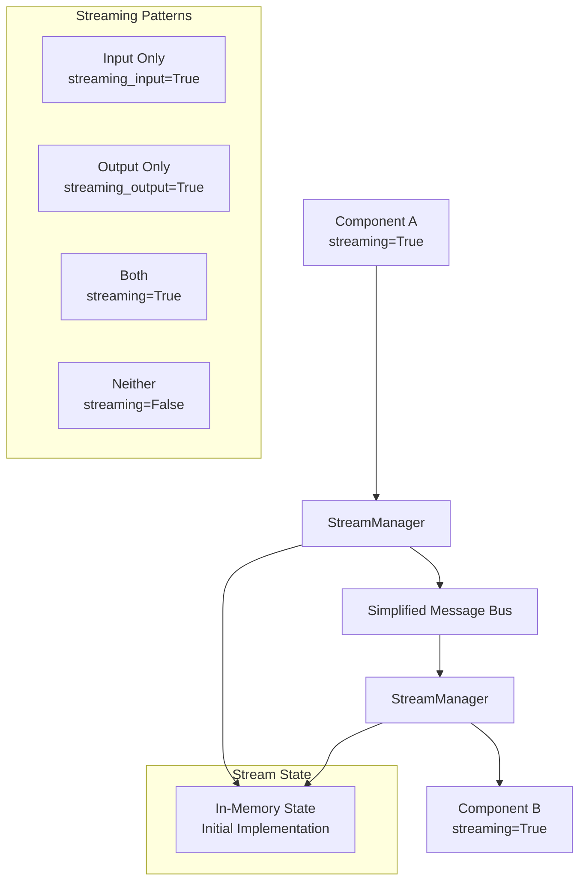

# Technical Design: Streaming Data Architecture

## Overview

This document defines the technical implementation for streaming data support in Woodwork components. The streaming system enables real-time data flow between components (e.g., LLM token streams, audio streams, progressive outputs) while maintaining reliability and order guarantees.

## Requirements

### Functional Requirements
- **FR1**: Support component-level streaming configuration (`streaming=True/False`)
- **FR2**: Handle flexible streaming patterns (input-only, output-only, both, or neither)
- **FR3**: Maintain chunk ordering and detect missing chunks
- **FR4**: Support components that output single chunks vs streaming chunks
- **FR5**: Enable streaming for text, audio, binary, and JSON data types
- **FR6**: Integrate with simplified message bus for initial implementation
- **FR7**: Support backpressure to prevent memory overflow

### Non-Functional Requirements
- **NFR1**: <50ms latency per chunk between components
- **NFR2**: Support up to 100 concurrent streams (initial implementation)
- **NFR3**: Graceful degradation when components fail
- **NFR4**: Memory usage scales linearly with active streams, not total data

## Architecture

### Core Components



### Data Flow

1. **Stream Initiation**: Component A requests new stream via StreamManager
2. **Chunk Emission**: Component A sends chunks with ordering metadata
3. **Transport**: Message bus routes chunks to target component
4. **Chunk Reception**: Component B receives ordered chunks via StreamManager
5. **Stream Completion**: Final chunk triggers stream cleanup

## Detailed Design

### 1. Enhanced Data Types

```python
# woodwork/types/streaming_data.py
from typing import AsyncGenerator, Optional, Union, Any, Dict, List
from dataclasses import dataclass, field
from enum import Enum
import asyncio
import uuid
import time
import json

class StreamDataType(Enum):
    TEXT = "text"
    AUDIO = "audio" 
    IMAGE = "image"
    BINARY = "binary"
    JSON = "json"

class StreamStatus(Enum):
    ACTIVE = "active"
    COMPLETED = "completed"
    FAILED = "failed"
    CANCELLED = "cancelled"

@dataclass
class StreamChunk:
    """Individual chunk in a data stream with reliability metadata"""
    stream_id: str
    chunk_index: int
    data: Union[str, bytes, dict, Any]
    data_type: StreamDataType
    is_final: bool = False
    chunk_size: Optional[int] = None
    checksum: Optional[str] = None  # For data integrity
    metadata: Dict[str, Any] = field(default_factory=dict)
    timestamp: float = field(default_factory=time.time)
    
    def to_dict(self) -> Dict[str, Any]:
        """Serialize for message bus transport"""
        return {
            "stream_id": self.stream_id,
            "chunk_index": self.chunk_index,
            "data": self._serialize_data(),
            "data_type": self.data_type.value,
            "is_final": self.is_final,
            "chunk_size": self.chunk_size,
            "checksum": self.checksum,
            "metadata": self.metadata,
            "timestamp": self.timestamp
        }
    
    def _serialize_data(self) -> Union[str, Dict[str, Any]]:
        """Serialize data based on type for JSON transport"""
        if self.data_type == StreamDataType.JSON:
            return self.data
        elif self.data_type == StreamDataType.BINARY:
            import base64
            return base64.b64encode(self.data).decode('utf-8')
        else:
            return str(self.data)
    
    @classmethod
    def from_dict(cls, data: Dict[str, Any]) -> 'StreamChunk':
        """Deserialize from message bus transport"""
        chunk = cls(
            stream_id=data["stream_id"],
            chunk_index=data["chunk_index"],
            data=data["data"],  # Will be deserialized based on type
            data_type=StreamDataType(data["data_type"]),
            is_final=data.get("is_final", False),
            chunk_size=data.get("chunk_size"),
            checksum=data.get("checksum"),
            metadata=data.get("metadata", {}),
            timestamp=data.get("timestamp", time.time())
        )
        chunk._deserialize_data(data["data"])
        return chunk
        
    def _deserialize_data(self, serialized_data: Any):
        """Deserialize data based on type"""
        if self.data_type == StreamDataType.BINARY:
            import base64
            self.data = base64.b64decode(serialized_data.encode('utf-8'))
        elif self.data_type == StreamDataType.JSON:
            self.data = serialized_data
        else:
            self.data = serialized_data

@dataclass
class StreamMetadata:
    """Metadata for stream management and monitoring"""
    stream_id: str
    session_id: str
    component_source: str
    component_target: str
    data_type: StreamDataType
    status: StreamStatus = StreamStatus.ACTIVE
    created_at: float = field(default_factory=time.time)
    completed_at: Optional[float] = None
    total_chunks: Optional[int] = None
    bytes_transferred: int = 0
    last_chunk_at: float = field(default_factory=time.time)
    
    # Reliability tracking
    expected_chunks: int = 0
    received_chunks: int = 0
    missing_chunks: List[int] = field(default_factory=list)
    
    def to_dict(self) -> Dict[str, Any]:
        return {
            "stream_id": self.stream_id,
            "session_id": self.session_id,
            "component_source": self.component_source,
            "component_target": self.component_target,
            "data_type": self.data_type.value,
            "status": self.status.value,
            "created_at": self.created_at,
            "completed_at": self.completed_at,
            "total_chunks": self.total_chunks,
            "bytes_transferred": self.bytes_transferred,
            "last_chunk_at": self.last_chunk_at,
            "expected_chunks": self.expected_chunks,
            "received_chunks": self.received_chunks,
            "missing_chunks": self.missing_chunks
        }
```

### 2. StreamManager Implementation

```python
# woodwork/core/stream_manager.py
from typing import AsyncGenerator, Optional, Dict, Callable, Set
from woodwork.types.streaming_data import StreamChunk, StreamMetadata, StreamDataType, StreamStatus
from woodwork.events import get_global_event_manager
import asyncio
import logging
import uuid
import time

log = logging.getLogger(__name__)

class StreamManager:
    """Manages streaming data between components with reliability guarantees"""
    
    def __init__(self, message_bus, state_store=None):
        self.message_bus = message_bus
        self.state_store = state_store  # Redis or in-memory
        
        # Active streams tracking
        self.active_streams: Dict[str, StreamMetadata] = {}
        self.stream_buffers: Dict[str, Dict[int, StreamChunk]] = {}  # chunk ordering
        self.stream_listeners: Dict[str, Set[Callable]] = {}
        
        # Backpressure management
        self.max_buffer_size = 1000  # chunks
        self.max_memory_usage = 100 * 1024 * 1024  # 100MB
        self.current_memory_usage = 0
        
        # Setup cleanup task
        self._cleanup_task = asyncio.create_task(self._periodic_cleanup())
        
    async def create_stream(
        self,
        session_id: str,
        component_source: str, 
        component_target: str,
        data_type: StreamDataType = StreamDataType.TEXT,
        stream_id: Optional[str] = None
    ) -> str:
        """Create new stream and return stream_id"""
        
        if stream_id is None:
            stream_id = f"stream-{uuid.uuid4()}"
            
        metadata = StreamMetadata(
            stream_id=stream_id,
            session_id=session_id,
            component_source=component_source,
            component_target=component_target,
            data_type=data_type
        )
        
        # Store in local cache and persistent state
        self.active_streams[stream_id] = metadata
        self.stream_buffers[stream_id] = {}
        self.stream_listeners[stream_id] = set()
        
        if self.state_store:
            await self._persist_stream_metadata(metadata)
            
        log.debug(f"Created stream {stream_id}: {component_source} -> {component_target}")
        
        # Emit stream creation event
        await get_global_event_manager().emit("stream.created", {
            "stream_id": stream_id,
            "metadata": metadata.to_dict()
        })
        
        return stream_id
        
    async def send_chunk(
        self,
        stream_id: str,
        data: Any,
        is_final: bool = False,
        metadata: Optional[Dict[str, Any]] = None
    ):
        """Send stream chunk to target component with reliability"""
        
        if stream_id not in self.active_streams:
            raise ValueError(f"Stream {stream_id} not found")
            
        stream_meta = self.active_streams[stream_id]
        
        if stream_meta.status != StreamStatus.ACTIVE:
            raise ValueError(f"Stream {stream_id} is not active (status: {stream_meta.status})")
        
        # Check backpressure
        if not await self._check_backpressure(stream_id):
            raise Exception(f"Backpressure limit reached for stream {stream_id}")
        
        # Create chunk
        chunk = StreamChunk(
            stream_id=stream_id,
            chunk_index=stream_meta.expected_chunks,
            data=data,
            data_type=stream_meta.data_type,
            is_final=is_final,
            chunk_size=len(str(data)) if data else 0,
            metadata=metadata or {}
        )
        
        # Update stream metadata
        stream_meta.expected_chunks += 1
        stream_meta.bytes_transferred += chunk.chunk_size or 0
        stream_meta.last_chunk_at = time.time()
        
        if is_final:
            stream_meta.status = StreamStatus.COMPLETED
            stream_meta.completed_at = time.time()
            stream_meta.total_chunks = stream_meta.expected_chunks
            
        # Send via message bus
        await self.message_bus.publish({
            "session_id": stream_meta.session_id,
            "event_type": "stream.chunk",
            "component_source": stream_meta.component_source,
            "component_target": stream_meta.component_target,
            "stream_id": stream_id,
            "is_stream": True,
            "payload": chunk.to_dict()
        })
        
        log.debug(f"Sent chunk {chunk.chunk_index} for stream {stream_id} (final: {is_final})")
        
        # Emit chunk sent event
        await get_global_event_manager().emit("stream.chunk_sent", {
            "stream_id": stream_id,
            "chunk_index": chunk.chunk_index,
            "is_final": is_final
        })
        
        # Cleanup completed streams
        if is_final:
            await self._cleanup_stream(stream_id, delay=30)  # Keep for 30s for late arrivals
            
    async def receive_stream(self, stream_id: str) -> AsyncGenerator[StreamChunk, None]:
        """Receive stream chunks as ordered async generator"""
        
        if stream_id not in self.active_streams:
            raise ValueError(f"Stream {stream_id} not found")
            
        stream_meta = self.active_streams[stream_id]
        buffer = self.stream_buffers[stream_id]
        next_expected_index = 0
        
        log.debug(f"Starting to receive stream {stream_id}")
        
        while True:
            # Check if next expected chunk is available
            if next_expected_index in buffer:
                chunk = buffer.pop(next_expected_index)
                stream_meta.received_chunks += 1
                
                log.debug(f"Yielding chunk {chunk.chunk_index} from stream {stream_id}")
                yield chunk
                
                next_expected_index += 1
                
                # Check if stream is complete
                if chunk.is_final:
                    log.debug(f"Stream {stream_id} completed")
                    break
                    
            else:
                # Wait for next chunk or timeout
                try:
                    await asyncio.wait_for(
                        self._wait_for_chunk(stream_id, next_expected_index),
                        timeout=30.0
                    )
                except asyncio.TimeoutError:
                    # Handle missing chunks
                    await self._handle_missing_chunk(stream_id, next_expected_index)
                    break
                    
        # Emit completion event
        await get_global_event_manager().emit("stream.completed", {
            "stream_id": stream_id,
            "chunks_received": stream_meta.received_chunks,
            "bytes_received": stream_meta.bytes_transferred
        })
        
    async def handle_chunk_received(self, chunk_data: Dict[str, Any]):
        """Handle incoming chunk from message bus"""
        
        try:
            chunk = StreamChunk.from_dict(chunk_data)
            stream_id = chunk.stream_id
            
            if stream_id not in self.active_streams:
                log.warning(f"Received chunk for unknown stream {stream_id}")
                return
                
            # Store in buffer for ordered delivery
            buffer = self.stream_buffers[stream_id]
            buffer[chunk.chunk_index] = chunk
            
            # Update memory usage tracking
            self.current_memory_usage += chunk.chunk_size or 0
            
            # Notify waiting receivers
            for listener in self.stream_listeners[stream_id]:
                listener()
                
            log.debug(f"Buffered chunk {chunk.chunk_index} for stream {stream_id}")
            
        except Exception as e:
            log.error(f"Error handling chunk: {e}")
            
    async def _check_backpressure(self, stream_id: str) -> bool:
        """Check if backpressure limits are exceeded"""
        
        buffer = self.stream_buffers.get(stream_id, {})
        
        # Check buffer size limit
        if len(buffer) >= self.max_buffer_size:
            log.warning(f"Buffer size limit reached for stream {stream_id}")
            return False
            
        # Check memory usage limit  
        if self.current_memory_usage >= self.max_memory_usage:
            log.warning(f"Memory usage limit reached: {self.current_memory_usage}")
            return False
            
        return True
        
    async def _wait_for_chunk(self, stream_id: str, chunk_index: int):
        """Wait for specific chunk to arrive"""
        
        # Create listener that resolves when chunk arrives
        future = asyncio.Future()
        
        def chunk_listener():
            buffer = self.stream_buffers.get(stream_id, {})
            if chunk_index in buffer and not future.done():
                future.set_result(True)
                
        self.stream_listeners[stream_id].add(chunk_listener)
        
        try:
            await future
        finally:
            self.stream_listeners[stream_id].discard(chunk_listener)
            
    async def _handle_missing_chunk(self, stream_id: str, chunk_index: int):
        """Handle missing chunk by requesting retransmission or failing gracefully"""
        
        stream_meta = self.active_streams[stream_id]
        stream_meta.missing_chunks.append(chunk_index)
        
        log.warning(f"Missing chunk {chunk_index} in stream {stream_id}")
        
        # Emit missing chunk event for potential retransmission
        await get_global_event_manager().emit("stream.chunk_missing", {
            "stream_id": stream_id,
            "chunk_index": chunk_index,
            "stream_metadata": stream_meta.to_dict()
        })
        
        # Mark stream as failed if too many missing chunks
        if len(stream_meta.missing_chunks) > 10:
            stream_meta.status = StreamStatus.FAILED
            log.error(f"Stream {stream_id} failed due to too many missing chunks")
            
    async def _cleanup_stream(self, stream_id: str, delay: float = 0):
        """Clean up stream resources after delay"""
        
        if delay > 0:
            await asyncio.sleep(delay)
            
        # Remove from active tracking
        if stream_id in self.active_streams:
            del self.active_streams[stream_id]
            
        if stream_id in self.stream_buffers:
            # Calculate memory to free
            buffer = self.stream_buffers[stream_id]
            for chunk in buffer.values():
                self.current_memory_usage -= chunk.chunk_size or 0
            del self.stream_buffers[stream_id]
            
        if stream_id in self.stream_listeners:
            del self.stream_listeners[stream_id]
            
        # Remove from persistent storage
        if self.state_store:
            await self._delete_stream_metadata(stream_id)
            
        log.debug(f"Cleaned up stream {stream_id}")
        
    async def _periodic_cleanup(self):
        """Periodic cleanup of old/stale streams"""
        
        while True:
            try:
                await asyncio.sleep(60)  # Run every minute
                
                current_time = time.time()
                stale_streams = []
                
                for stream_id, metadata in self.active_streams.items():
                    # Mark streams as stale if no activity for 5 minutes
                    if current_time - metadata.last_chunk_at > 300:
                        stale_streams.append(stream_id)
                        
                for stream_id in stale_streams:
                    log.warning(f"Cleaning up stale stream {stream_id}")
                    await self._cleanup_stream(stream_id)
                    
            except Exception as e:
                log.error(f"Error in periodic cleanup: {e}")
                
    async def _persist_stream_metadata(self, metadata: StreamMetadata):
        """Persist stream metadata to state store"""
        if self.state_store:
            await self.state_store.set(
                f"stream_metadata:{metadata.stream_id}",
                json.dumps(metadata.to_dict()),
                ex=3600  # Expire after 1 hour
            )
            
    async def _delete_stream_metadata(self, stream_id: str):
        """Delete stream metadata from state store"""
        if self.state_store:
            await self.state_store.delete(f"stream_metadata:{stream_id}")
            
    def get_stream_info(self, stream_id: str) -> Optional[Dict[str, Any]]:
        """Get current stream information"""
        if stream_id in self.active_streams:
            metadata = self.active_streams[stream_id]
            buffer_size = len(self.stream_buffers.get(stream_id, {}))
            
            return {
                "metadata": metadata.to_dict(),
                "buffer_size": buffer_size,
                "listeners": len(self.stream_listeners.get(stream_id, set()))
            }
        return None
        
    async def close(self):
        """Cleanup all resources"""
        if hasattr(self, '_cleanup_task'):
            self._cleanup_task.cancel()
            
        # Cleanup all active streams
        stream_ids = list(self.active_streams.keys())
        for stream_id in stream_ids:
            await self._cleanup_stream(stream_id)
```

### 3. Component Integration with Streaming Configuration

```python
# woodwork/components/streaming_mixin.py
from typing import AsyncGenerator, Optional, Any, Dict, Union
from woodwork.core.stream_manager import StreamManager
from woodwork.types.streaming_data import StreamDataType

class StreamingMixin:
    """Mixin to add streaming capabilities to components based on configuration"""
    
    def __init__(self, *args, **kwargs):
        super().__init__(*args, **kwargs)
        self._stream_manager: Optional[StreamManager] = None
        
        # Parse streaming configuration
        config = kwargs.get('config', {})
        self.streaming_enabled = config.get('streaming', False)
        self.streaming_input = config.get('streaming_input', self.streaming_enabled)
        self.streaming_output = config.get('streaming_output', self.streaming_enabled)
        
    def set_stream_manager(self, stream_manager: StreamManager):
        """Set the stream manager for this component"""
        self._stream_manager = stream_manager
        
    async def create_output_stream(
        self,
        target_component: str,
        data_type: StreamDataType = StreamDataType.TEXT,
        session_id: Optional[str] = None
    ) -> str:
        """Create output stream to target component"""
        if not self._stream_manager or not self.streaming_output:
            raise RuntimeError("Streaming output not enabled or StreamManager not configured")
            
        return await self._stream_manager.create_stream(
            session_id=session_id or self._get_session_id(),
            component_source=self.name,
            component_target=target_component,
            data_type=data_type
        )
        
    async def stream_output(self, stream_id: str, data: Any, is_final: bool = False):
        """Send data chunk to output stream"""
        if not self._stream_manager or not self.streaming_output:
            raise RuntimeError("Streaming output not enabled or StreamManager not configured")
            
        await self._stream_manager.send_chunk(stream_id, data, is_final)
        
    async def receive_input_stream(self, stream_id: str) -> AsyncGenerator[Any, None]:
        """Receive input stream chunks"""
        if not self._stream_manager or not self.streaming_input:
            raise RuntimeError("Streaming input not enabled or StreamManager not configured")
            
        async for chunk in self._stream_manager.receive_stream(stream_id):
            yield chunk.data
            
    async def process_input(self, data: Union[Any, str]) -> Any:
        """Process input - can handle both streaming and non-streaming data"""
        if isinstance(data, str) and data.startswith("stream:"):
            # Handle streaming input
            stream_id = data.replace("stream:", "")
            accumulated_data = []
            
            if self.streaming_input:
                async for chunk in self.receive_input_stream(stream_id):
                    accumulated_data.append(chunk)
                    # Some components might process chunks individually
                    if hasattr(self, 'process_chunk'):
                        await self.process_chunk(chunk)
                        
                # Process accumulated data for components that need full input
                return await self._process_accumulated_input(accumulated_data)
            else:
                # Non-streaming component receiving stream - accumulate all first
                async for chunk in self.receive_input_stream(stream_id):
                    accumulated_data.append(chunk)
                return await self.process("".join(accumulated_data))
        else:
            # Handle regular non-streaming input
            return await self.process(data)
    
    async def _process_accumulated_input(self, chunks: list) -> Any:
        """Process accumulated streaming input - override in subclasses"""
        full_input = "".join(str(chunk) for chunk in chunks)
        return await self.process(full_input)
            
    def _get_session_id(self) -> str:
        """Get current session ID - override in component implementation"""
        return "default-session"

# Updated LLM component with streaming configuration
class LLMComponent(StreamingMixin):
    def __init__(self, name: str, config: Dict[str, Any]):
        super().__init__(name, config)
        # LLM typically needs full input before it can start streaming output
        # So it's usually streaming_input=False, streaming_output=True
        
    async def process(self, input_text: str) -> Union[str, str]:
        """Process input and return result (streaming or non-streaming)"""
        if self.streaming_output:
            return await self.stream_response(input_text)
        else:
            # Non-streaming response
            return await self.llm.generate(input_text)
    
    async def stream_response(self, input_text: str) -> str:
        """Generate streaming response"""
        # Create output stream
        stream_id = await self.create_output_stream(
            target_component="output",  # Default target
            data_type=StreamDataType.TEXT
        )
        
        # Stream tokens as they're generated
        async for token in self.llm.stream_completion(input_text):
            await self.stream_output(stream_id, token)
            
        # Send final chunk
        await self.stream_output(stream_id, "", is_final=True)
        
        return f"stream:{stream_id}"
```

## Integration Points

### 1. Simplified Message Bus for Initial Implementation

```python
# woodwork/core/simple_message_bus.py
import asyncio
from typing import Dict, List, Callable, Any
from collections import defaultdict
import json

class SimpleMessageBus:
    """Simplified in-memory message bus for streaming implementation"""
    
    def __init__(self):
        self.subscribers: Dict[str, List[Callable]] = defaultdict(list)
        self.running = False
        
    async def start(self):
        """Start the message bus"""
        self.running = True
        
    async def stop(self):
        """Stop the message bus"""
        self.running = False
        
    async def publish(self, topic: str, data: Any):
        """Publish message to topic"""
        if not self.running:
            return
            
        # Call all subscribers for this topic
        for callback in self.subscribers[topic]:
            try:
                if asyncio.iscoroutinefunction(callback):
                    await callback(data)
                else:
                    callback(data)
            except Exception as e:
                print(f"Error in message bus subscriber: {e}")
    
    def subscribe(self, topic: str, callback: Callable):
        """Subscribe to topic"""
        self.subscribers[topic].append(callback)
        
    def unsubscribe(self, topic: str, callback: Callable):
        """Unsubscribe from topic"""
        if callback in self.subscribers[topic]:
            self.subscribers[topic].remove(callback)

# Integration with streaming
async def setup_streaming(message_bus: SimpleMessageBus, stream_manager):
    """Setup streaming integration with simplified message bus"""
    
    async def handle_stream_chunk(event_data):
        chunk_data = event_data.get("payload", {})
        await stream_manager.handle_chunk_received(chunk_data)
        
    # Register handler for stream chunks
    message_bus.subscribe("stream.chunk", handle_stream_chunk)
```

### 2. Event System Integration

```python
# woodwork/types/streaming_events.py
from woodwork.types.events import BasePayload
from dataclasses import dataclass

@dataclass
class StreamCreatedPayload(BasePayload):
    stream_id: str
    source_component: str
    target_component: str
    data_type: str

@dataclass  
class StreamChunkPayload(BasePayload):
    stream_id: str
    chunk_index: int
    is_final: bool = False
    data_size: int = 0

@dataclass
class StreamCompletedPayload(BasePayload):
    stream_id: str
    total_chunks: int
    bytes_transferred: int
    duration_ms: float

# Register with PayloadRegistry
from woodwork.types.events import PayloadRegistry

PayloadRegistry.register("stream.created", StreamCreatedPayload)
PayloadRegistry.register("stream.chunk", StreamChunkPayload) 
PayloadRegistry.register("stream.completed", StreamCompletedPayload)
```

## Testing Strategy

### Unit Tests
- StreamChunk serialization/deserialization
- StreamManager stream creation and management
- Chunk ordering and missing chunk detection
- Backpressure handling

### Integration Tests  
- End-to-end streaming between mock components
- Message bus integration with chunk routing
- Stream recovery after component restart
- Concurrent stream handling

### Performance Tests
- Stream latency under load
- Memory usage with multiple concurrent streams
- Backpressure behavior verification
- Cleanup performance with many streams

## Monitoring and Metrics

```python
# Metrics to emit
class StreamingMetrics:
    # Performance
    stream_creation_time = "stream.creation_time_ms"
    chunk_processing_time = "stream.chunk_processing_time_ms"  
    end_to_end_latency = "stream.end_to_end_latency_ms"
    
    # Reliability
    missing_chunks = "stream.missing_chunks_count"
    failed_streams = "stream.failed_streams_count"
    retransmissions = "stream.retransmissions_count"
    
    # Resource usage
    active_streams = "stream.active_streams_count"
    memory_usage = "stream.memory_usage_bytes"
    buffer_utilization = "stream.buffer_utilization_percent"
```

## Working Demo: Streaming LLM Output

### Configuration Example

```python
# examples/streaming-llm-demo/main.ww
input_component = cli {
    streaming = False  # CLI input is not streaming
}

llm_component = openai {
    model = "gpt-3.5-turbo"
    streaming = True   # Enable streaming output
    streaming_input = False   # Needs full input first
    streaming_output = True   # Stream tokens as generated
}

output_component = cli {
    streaming = True   # Can handle streaming input
    streaming_input = True   # Display tokens as they arrive
    streaming_output = False  # No further output needed
}
```

### Component Implementation

```python
# examples/streaming-llm-demo/components.py
from woodwork.components.streaming_mixin import StreamingMixin
from woodwork.components.llm import LLMComponent
from woodwork.components.input import CLIInputComponent  
from woodwork.components.output import CLIOutputComponent

class StreamingLLMDemo(LLMComponent, StreamingMixin):
    def __init__(self, name: str, config: dict):
        super().__init__(name, config)
        
    async def process(self, input_text: str):
        """Process input and stream response"""
        if self.streaming_output:
            return await self.stream_response(input_text)
        else:
            return await self.generate_full_response(input_text)
            
    async def stream_response(self, input_text: str) -> str:
        """Generate streaming response token by token"""
        stream_id = await self.create_output_stream("output_component")
        
        # Simulate streaming tokens (replace with actual LLM streaming)
        tokens = input_text.split()
        for i, token in enumerate(tokens):
            await asyncio.sleep(0.1)  # Simulate processing time
            await self.stream_output(stream_id, f"{token} ", is_final=(i == len(tokens) - 1))
            
        return f"stream:{stream_id}"

class StreamingCLIOutput(CLIOutputComponent, StreamingMixin):
    def __init__(self, name: str, config: dict):
        super().__init__(name, config)
        
    async def process_input(self, data):
        """Handle both streaming and non-streaming input"""
        if isinstance(data, str) and data.startswith("stream:"):
            # Handle streaming input
            stream_id = data.replace("stream:", "")
            print("Response: ", end="", flush=True)
            
            async for chunk in self.receive_input_stream(stream_id):
                print(chunk, end="", flush=True)
            
            print()  # New line at end
        else:
            # Handle regular input
            print(f"Response: {data}")
```

### Demo Runner

```python
# examples/streaming-llm-demo/demo.py
import asyncio
from woodwork.core.simple_message_bus import SimpleMessageBus
from woodwork.core.stream_manager import StreamManager
from components import StreamingLLMDemo, StreamingCLIOutput
from woodwork.components.input import CLIInputComponent

async def main():
    # Setup message bus and stream manager
    message_bus = SimpleMessageBus()
    stream_manager = StreamManager(message_bus)
    await message_bus.start()
    
    # Create components
    input_comp = CLIInputComponent("input", {"streaming": False})
    llm_comp = StreamingLLMDemo("llm", {
        "streaming": True, 
        "streaming_output": True,
        "model": "gpt-3.5-turbo"
    })
    output_comp = StreamingCLIOutput("output", {
        "streaming_input": True
    })
    
    # Set up streaming
    llm_comp.set_stream_manager(stream_manager)
    output_comp.set_stream_manager(stream_manager)
    
    print("Streaming LLM Demo")
    print("Type 'quit' to exit")
    
    while True:
        user_input = input("\n> ")
        if user_input.lower() == 'quit':
            break
            
        try:
            # Process through pipeline
            processed_input = await input_comp.process(user_input)
            llm_result = await llm_comp.process(processed_input)
            await output_comp.process_input(llm_result)
            
        except Exception as e:
            print(f"Error: {e}")
    
    await message_bus.stop()

if __name__ == "__main__":
    asyncio.run(main())
```

## Current Implementation Status

### Phase 1: Core Implementation ✅ COMPLETED
- ✅ Implemented component-level streaming configuration (`streaming=True/False`)
- ✅ Created StreamChunk and StreamMetadata classes with complete serialization support
- ✅ Built StreamManager with in-memory state and reliability features
- ✅ Added StreamingMixin for flexible component integration
- ✅ Implemented StreamBuffer for chunk ordering and reliability
- ✅ Created SimpleMessageBus for streaming integration
- ✅ Full streaming lifecycle with creation, chunk sending, and completion

### Phase 2: Integration with Task Master Event Loop ⚠️ CHALLENGES IDENTIFIED
**Current Issue**: Task Master runs in separate thread from component event loops, causing timing problems with streaming integration. This validates the need for decentralized orchestration as outlined in the distributed communication design.

**Implemented Features**:
- ✅ Message bus abstraction (SimpleMessageBus + MessageBusAdapter)
- ✅ Backpressure handling with configurable limits
- ✅ Error handling and stream recovery
- ✅ Basic integration with component base class

**Blocked Features** (requires distributed communication):
- ❌ Full Task Master integration (cross-thread event loop issues)
- ❌ Session-based routing (needs distributed session management)
- ❌ Production-ready persistence (requires distributed state store)

### Phase 3: Production Features 🔄 IN PROGRESS
- ✅ Performance optimization and memory management
- ✅ Stream monitoring and metrics collection 
- ⏳ Advanced streaming patterns (waiting for distributed architecture)
- ⏳ Production deployment examples (waiting for build system)

### Phase 4: Integration and Polish ⏳ PENDING
- ⏳ Integration with build system and containerization (waiting for build system)
- ⏳ Task Master replacement with distributed orchestration
- ⏳ Comprehensive testing suite with various streaming patterns
- ⏳ Documentation and best practices guide

## Integration with Distributed Architecture

### Current Streaming Architecture Readiness

The streaming implementation is **ready for integration** with the distributed communication architecture:

1. **Message Bus Compatible**: StreamManager already uses SimpleMessageBus which can be swapped for the full distributed message bus
2. **Component Isolation Ready**: StreamingMixin allows components to operate independently without Task Master
3. **Session Support Built-in**: Stream metadata includes session_id for multi-tenant operations
4. **Reliability Features**: Chunk ordering, backpressure, and error handling are implemented

### Required Changes for Distributed Integration

1. **Replace SimpleMessageBus**: Swap for Redis/NATS message bus implementation from design 02
2. **Remove Task Master Dependency**: Components can use StreamingMixin directly without central orchestration
3. **Add Distributed Session Management**: Integrate with SessionManager from design 04
4. **Enable Component Discovery**: Connect with ComponentRegistry for target component resolution

### Migration Path to Distributed Architecture

```python
# Current Task Master approach (has cross-thread issues)
task_master.add_tools([input_component, llm_component, output_component])
task_master.execute_workflow()

# Target Distributed approach (streaming ready)
# Components run independently, communicate via message bus + streaming
input_component = InputComponent(streaming_output=True)
llm_component = LLMComponent(streaming_input=False, streaming_output=True)  
output_component = OutputComponent(streaming_input=True)

# Each component manages its own streaming without Task Master
stream_id = await llm_component.create_output_stream("output_component")
await llm_component.stream_response(input_data, stream_id)
async for chunk in output_component.receive_input_stream(stream_id):
    # Process streaming data
```

The streaming architecture serves as the **foundation for component-to-component communication** in the distributed system, eliminating the need for the centralized Task Master.