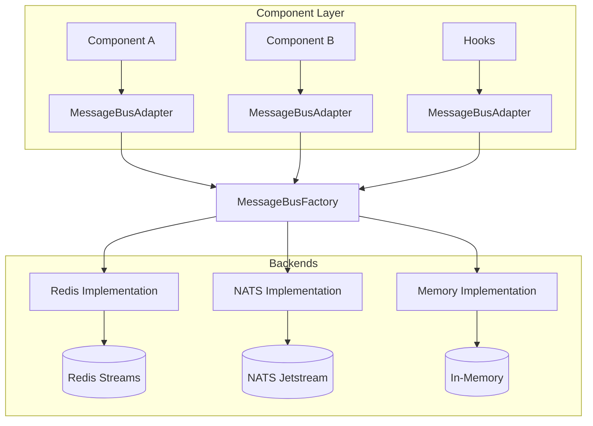
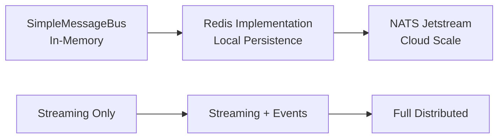

# Technical Design: Message Bus Abstraction

## Overview

This document defines the technical implementation for the message bus abstraction layer that enables seamless communication between components in both local development and cloud production environments. The abstraction provides a unified interface for different message bus backends while maintaining performance and reliability.

## Requirements

### Functional Requirements
- **FR1**: Unified interface for local and cloud message bus implementations
- **FR2**: Support for Redis Streams (local/cloud), NATS Jetstream (cloud), and in-memory (dev) backends
- **FR3**: Message delivery guarantees (at-least-once, ordering within sessions)
- **FR4**: Session-based message routing and isolation
- **FR5**: Dead letter queue handling for failed messages
- **FR6**: Pub/sub pattern for hooks and point-to-point for component-to-component communication
- **FR7**: Automatic failover and retry mechanisms

### Non-Functional Requirements
- **NFR1**: <10ms additional latency overhead from abstraction
- **NFR2**: Support 1000+ concurrent sessions with horizontal scaling
- **NFR3**: Zero message loss during normal operations
- **NFR4**: Graceful degradation when backend unavailable

## Architecture

### High-Level Architecture



### Message Flow Patterns

1. **Component-to-Component**: Direct message delivery between components (ordered, session-isolated)
2. **Hook Broadcasting**: All components → Hooks (fanout, concurrent)  
3. **Stream Data**: Producer → Consumer (ordered chunks with backpressure)

**Note**: Pipe transformations are handled **internally by each component** when it receives messages, not by the message bus itself.

## Detailed Design

### 1. Core Abstraction Interface

```python
# woodwork/core/message_bus.py
from abc import ABC, abstractmethod
from typing import Dict, List, Callable, Optional, Any, AsyncGenerator
from dataclasses import dataclass
from enum import Enum
import asyncio
import time
import uuid

class MessageDeliveryMode(Enum):
    AT_MOST_ONCE = "at_most_once"      # Fire and forget
    AT_LEAST_ONCE = "at_least_once"    # Guaranteed delivery
    EXACTLY_ONCE = "exactly_once"      # Deduplicated delivery (future)

class MessagePattern(Enum):
    PUB_SUB = "pub_sub"                # One-to-many (hooks)
    POINT_TO_POINT = "point_to_point"  # One-to-one (component chain)
    STREAM = "stream"                  # Ordered stream data

@dataclass
class MessageEnvelope:
    """Standard message wrapper for all message bus implementations"""
    message_id: str
    session_id: str
    event_type: str
    component_source: str
    component_target: Optional[str] = None
    timestamp: float = None
    delivery_mode: MessageDeliveryMode = MessageDeliveryMode.AT_LEAST_ONCE
    pattern: MessagePattern = MessagePattern.POINT_TO_POINT
    payload: Dict[str, Any] = None
    metadata: Dict[str, Any] = None
    retry_count: int = 0
    max_retries: int = 3
    
    def __post_init__(self):
        if self.timestamp is None:
            self.timestamp = time.time()
        if self.payload is None:
            self.payload = {}
        if self.metadata is None:
            self.metadata = {}
    
    def to_dict(self) -> Dict[str, Any]:
        return {
            "message_id": self.message_id,
            "session_id": self.session_id,
            "event_type": self.event_type,
            "component_source": self.component_source,
            "component_target": self.component_target,
            "timestamp": self.timestamp,
            "delivery_mode": self.delivery_mode.value,
            "pattern": self.pattern.value,
            "payload": self.payload,
            "metadata": self.metadata,
            "retry_count": self.retry_count,
            "max_retries": self.max_retries
        }
    
    @classmethod
    def from_dict(cls, data: Dict[str, Any]) -> 'MessageEnvelope':
        return cls(
            message_id=data["message_id"],
            session_id=data["session_id"],
            event_type=data["event_type"],
            component_source=data["component_source"],
            component_target=data.get("component_target"),
            timestamp=data.get("timestamp", time.time()),
            delivery_mode=MessageDeliveryMode(data.get("delivery_mode", "at_least_once")),
            pattern=MessagePattern(data.get("pattern", "point_to_point")),
            payload=data.get("payload", {}),
            metadata=data.get("metadata", {}),
            retry_count=data.get("retry_count", 0),
            max_retries=data.get("max_retries", 3)
        )

class MessageBusInterface(ABC):
    """Abstract interface for message bus implementations"""
    
    @abstractmethod
    async def publish(self, envelope: MessageEnvelope) -> bool:
        """Publish message to the bus"""
        pass
    
    @abstractmethod
    async def subscribe(
        self, 
        event_pattern: str, 
        handler: Callable[[MessageEnvelope], None],
        session_id: Optional[str] = None,
        component_id: Optional[str] = None
    ) -> str:
        """Subscribe to messages matching pattern"""
        pass
    
    @abstractmethod
    async def unsubscribe(self, subscription_id: str) -> bool:
        """Remove subscription"""
        pass
    
    @abstractmethod
    async def create_session_queue(self, session_id: str) -> bool:
        """Create isolated queue for session"""
        pass
    
    @abstractmethod
    async def delete_session_queue(self, session_id: str) -> bool:
        """Delete session queue and cleanup"""
        pass
    
    @abstractmethod
    async def get_dead_letter_messages(self, limit: int = 100) -> List[MessageEnvelope]:
        """Retrieve messages from dead letter queue"""
        pass
    
    @abstractmethod
    async def health_check(self) -> Dict[str, Any]:
        """Check backend health and return status"""
        pass
    
    @abstractmethod
    async def close(self):
        """Cleanup connections and resources"""
        pass

class MessageBusAdapter:
    """High-level adapter providing convenience methods"""
    
    def __init__(self, message_bus: MessageBusInterface):
        self.message_bus = message_bus
        self._subscriptions: Dict[str, str] = {}  # local_id -> subscription_id
        
    async def emit_event(
        self,
        event_type: str,
        payload: Dict[str, Any],
        session_id: str,
        component_source: str,
        component_target: Optional[str] = None,
        pattern: MessagePattern = MessagePattern.PUB_SUB
    ) -> bool:
        """Emit event with automatic envelope creation"""
        
        envelope = MessageEnvelope(
            message_id=f"msg-{uuid.uuid4()}",
            session_id=session_id,
            event_type=event_type,
            component_source=component_source,
            component_target=component_target,
            pattern=pattern,
            payload=payload
        )
        
        return await self.message_bus.publish(envelope)
    
    async def send_to_component(
        self,
        target_component: str,
        event_type: str,
        payload: Dict[str, Any],
        session_id: str,
        component_source: str
    ) -> bool:
        """Send message directly to specific component"""
        
        return await self.emit_event(
            event_type=event_type,
            payload=payload,
            session_id=session_id,
            component_source=component_source,
            component_target=target_component,
            pattern=MessagePattern.POINT_TO_POINT
        )
    
    async def register_hook(
        self,
        event_pattern: str,
        handler: Callable[[Dict[str, Any]], None],
        component_id: Optional[str] = None
    ) -> str:
        """Register hook for events matching pattern"""
        
        async def envelope_handler(envelope: MessageEnvelope):
            try:
                await handler(envelope.payload)
            except Exception as e:
                import logging
                log = logging.getLogger(__name__)
                log.error(f"Hook handler error: {e}")
        
        subscription_id = await self.message_bus.subscribe(
            event_pattern=event_pattern,
            handler=envelope_handler,
            component_id=component_id
        )
        
        local_id = f"hook-{len(self._subscriptions)}"
        self._subscriptions[local_id] = subscription_id
        return local_id
    
    async def register_component_listener(
        self,
        component_id: str,
        handler: Callable[[Dict[str, Any]], None],
        session_id: Optional[str] = None
    ) -> str:
        """Register component to receive targeted messages"""
        
        async def envelope_handler(envelope: MessageEnvelope):
            try:
                # Only process messages targeted to this component
                if envelope.component_target == component_id:
                    await handler(envelope.payload)
            except Exception as e:
                import logging
                log = logging.getLogger(__name__)
                log.error(f"Component handler error: {e}")
        
        subscription_id = await self.message_bus.subscribe(
            event_pattern="*",  # Listen to all events, filter in handler
            handler=envelope_handler,
            session_id=session_id,
            component_id=component_id
        )
        
        local_id = f"component-{component_id}"
        self._subscriptions[local_id] = subscription_id
        return local_id
    
    async def close(self):
        """Cleanup all subscriptions and close bus"""
        for subscription_id in self._subscriptions.values():
            await self.message_bus.unsubscribe(subscription_id)
        await self.message_bus.close()
```

### 2. Redis Streams Implementation

```python
# woodwork/core/message_bus/redis_implementation.py
import redis.asyncio as redis
import json
import logging
from typing import Dict, List, Callable, Optional, Any
from woodwork.core.message_bus import MessageBusInterface, MessageEnvelope

log = logging.getLogger(__name__)

class RedisMessageBus(MessageBusInterface):
    """Redis Streams implementation of message bus"""
    
    def __init__(
        self,
        redis_url: str = "redis://localhost:6379",
        stream_prefix: str = "woodwork",
        consumer_group: str = "woodwork-components",
        max_retries: int = 3
    ):
        self.redis_url = redis_url
        self.stream_prefix = stream_prefix
        self.consumer_group = consumer_group
        self.max_retries = max_retries
        
        self.redis_client: Optional[redis.Redis] = None
        self.consumers: Dict[str, asyncio.Task] = {}
        self.subscriptions: Dict[str, Dict] = {}
        self._running = False
        
    async def _ensure_connected(self):
        """Ensure Redis connection is established"""
        if self.redis_client is None:
            self.redis_client = redis.from_url(self.redis_url)
            await self.redis_client.ping()  # Test connection
            log.info(f"Connected to Redis: {self.redis_url}")
    
    def _get_stream_name(self, event_type: str, session_id: Optional[str] = None) -> str:
        """Generate stream name for event type and optional session"""
        if session_id:
            return f"{self.stream_prefix}:session:{session_id}:{event_type}"
        else:
            return f"{self.stream_prefix}:global:{event_type}"
    
    def _get_consumer_name(self, component_id: str) -> str:
        """Generate unique consumer name"""
        import socket
        hostname = socket.gethostname()
        return f"{component_id}-{hostname}"
    
    async def publish(self, envelope: MessageEnvelope) -> bool:
        """Publish message to Redis stream"""
        try:
            await self._ensure_connected()
            
            # Determine target stream
            if envelope.pattern == MessagePattern.POINT_TO_POINT and envelope.session_id:
                stream_name = self._get_stream_name(envelope.event_type, envelope.session_id)
            else:
                stream_name = self._get_stream_name(envelope.event_type)
            
            # Serialize message
            message_data = {
                "envelope": json.dumps(envelope.to_dict())
            }
            
            # Add to stream
            message_id = await self.redis_client.xadd(stream_name, message_data)
            
            log.debug(f"Published message {envelope.message_id} to {stream_name}: {message_id}")
            return True
            
        except Exception as e:
            log.error(f"Failed to publish message: {e}")
            return False
    
    async def subscribe(
        self,
        event_pattern: str,
        handler: Callable[[MessageEnvelope], None],
        session_id: Optional[str] = None,
        component_id: Optional[str] = None
    ) -> str:
        """Subscribe to messages matching pattern"""
        try:
            await self._ensure_connected()
            
            subscription_id = f"sub-{uuid.uuid4()}"
            consumer_name = self._get_consumer_name(component_id or "unknown")
            
            # Store subscription info
            self.subscriptions[subscription_id] = {
                "event_pattern": event_pattern,
                "handler": handler,
                "session_id": session_id,
                "component_id": component_id,
                "consumer_name": consumer_name,
                "streams": []
            }
            
            # Determine streams to monitor
            if event_pattern == "*":
                # Monitor all streams - need discovery mechanism
                streams = await self._discover_streams(session_id)
            else:
                # Monitor specific event type
                stream_name = self._get_stream_name(event_pattern, session_id)
                streams = [stream_name]
                
            self.subscriptions[subscription_id]["streams"] = streams
            
            # Create consumer groups if they don't exist
            for stream_name in streams:
                try:
                    await self.redis_client.xgroup_create(
                        stream_name, self.consumer_group, id='0', mkstream=True
                    )
                except redis.RedisError as e:
                    if "BUSYGROUP" not in str(e):  # Group already exists
                        raise
            
            # Start consumer task
            consumer_task = asyncio.create_task(
                self._consumer_loop(subscription_id, streams, consumer_name, handler)
            )
            self.consumers[subscription_id] = consumer_task
            
            log.info(f"Created subscription {subscription_id} for pattern {event_pattern}")
            return subscription_id
            
        except Exception as e:
            log.error(f"Failed to create subscription: {e}")
            raise
    
    async def _consumer_loop(
        self,
        subscription_id: str,
        streams: List[str],
        consumer_name: str,
        handler: Callable[[MessageEnvelope], None]
    ):
        """Main consumer loop for processing messages"""
        
        try:
            while self._running and subscription_id in self.subscriptions:
                try:
                    # Read from multiple streams
                    stream_dict = {stream: ">" for stream in streams}
                    
                    messages = await self.redis_client.xreadgroup(
                        self.consumer_group,
                        consumer_name,
                        stream_dict,
                        count=10,
                        block=1000  # 1 second timeout
                    )
                    
                    for stream, stream_messages in messages:
                        for message_id, fields in stream_messages:
                            try:
                                # Deserialize envelope
                                envelope_data = json.loads(fields[b'envelope'])
                                envelope = MessageEnvelope.from_dict(envelope_data)
                                
                                # Call handler
                                if asyncio.iscoroutinefunction(handler):
                                    await handler(envelope)
                                else:
                                    handler(envelope)
                                
                                # Acknowledge message
                                await self.redis_client.xack(
                                    stream, self.consumer_group, message_id
                                )
                                
                            except Exception as e:
                                log.error(f"Error processing message {message_id}: {e}")
                                
                                # Handle retry logic
                                await self._handle_message_retry(
                                    stream, message_id, envelope, e
                                )
                                
                except redis.RedisError as e:
                    log.warning(f"Redis error in consumer loop: {e}")
                    await asyncio.sleep(1)
                except asyncio.CancelledError:
                    break
                except Exception as e:
                    log.error(f"Unexpected error in consumer loop: {e}")
                    await asyncio.sleep(1)
                    
        except asyncio.CancelledError:
            log.info(f"Consumer loop cancelled for subscription {subscription_id}")
        finally:
            log.info(f"Consumer loop ended for subscription {subscription_id}")
    
    async def _handle_message_retry(
        self,
        stream: str,
        message_id: str,
        envelope: MessageEnvelope,
        error: Exception
    ):
        """Handle message retry logic"""
        
        envelope.retry_count += 1
        
        if envelope.retry_count <= envelope.max_retries:
            # Requeue for retry (simplified - could use delay)
            log.warning(f"Retrying message {message_id} (attempt {envelope.retry_count})")
            # In real implementation, might delay retry or use different queue
        else:
            # Move to dead letter queue
            log.error(f"Message {message_id} failed after {envelope.max_retries} attempts")
            await self._move_to_dead_letter(stream, message_id, envelope, error)
            
            # Acknowledge original message to remove from pending
            await self.redis_client.xack(stream, self.consumer_group, message_id)
    
    async def _move_to_dead_letter(
        self,
        stream: str,
        message_id: str,
        envelope: MessageEnvelope,
        error: Exception
    ):
        """Move failed message to dead letter queue"""
        
        dead_letter_stream = f"{self.stream_prefix}:dead_letter"
        
        dead_letter_data = {
            "original_stream": stream,
            "original_message_id": message_id,
            "envelope": json.dumps(envelope.to_dict()),
            "error": str(error),
            "failed_at": time.time()
        }
        
        await self.redis_client.xadd(dead_letter_stream, dead_letter_data)
    
    async def _discover_streams(self, session_id: Optional[str] = None) -> List[str]:
        """Discover existing streams for wildcard subscriptions"""
        
        pattern = f"{self.stream_prefix}:*"
        if session_id:
            pattern = f"{self.stream_prefix}:session:{session_id}:*"
            
        keys = await self.redis_client.keys(pattern)
        return [key.decode() for key in keys if key.decode().count(':') >= 3]
    
    async def unsubscribe(self, subscription_id: str) -> bool:
        """Remove subscription and stop consumer"""
        try:
            if subscription_id in self.consumers:
                # Cancel consumer task
                task = self.consumers[subscription_id]
                task.cancel()
                del self.consumers[subscription_id]
                
            if subscription_id in self.subscriptions:
                del self.subscriptions[subscription_id]
                
            log.info(f"Removed subscription {subscription_id}")
            return True
            
        except Exception as e:
            log.error(f"Failed to unsubscribe {subscription_id}: {e}")
            return False
    
    async def create_session_queue(self, session_id: str) -> bool:
        """Create dedicated streams for session (streams are created on demand)"""
        # Redis streams are created automatically when first message is published
        log.info(f"Session queue will be created on demand for {session_id}")
        return True
    
    async def delete_session_queue(self, session_id: str) -> bool:
        """Delete all streams for a session"""
        try:
            await self._ensure_connected()
            
            pattern = f"{self.stream_prefix}:session:{session_id}:*"
            keys = await self.redis_client.keys(pattern)
            
            if keys:
                await self.redis_client.delete(*keys)
                log.info(f"Deleted {len(keys)} streams for session {session_id}")
                
            return True
            
        except Exception as e:
            log.error(f"Failed to delete session queue {session_id}: {e}")
            return False
    
    async def get_dead_letter_messages(self, limit: int = 100) -> List[MessageEnvelope]:
        """Retrieve messages from dead letter queue"""
        try:
            await self._ensure_connected()
            
            dead_letter_stream = f"{self.stream_prefix}:dead_letter"
            
            messages = await self.redis_client.xrange(
                dead_letter_stream, count=limit
            )
            
            envelopes = []
            for message_id, fields in messages:
                try:
                    envelope_data = json.loads(fields[b'envelope'])
                    envelope = MessageEnvelope.from_dict(envelope_data)
                    envelopes.append(envelope)
                except Exception as e:
                    log.warning(f"Failed to parse dead letter message: {e}")
                    
            return envelopes
            
        except Exception as e:
            log.error(f"Failed to retrieve dead letter messages: {e}")
            return []
    
    async def health_check(self) -> Dict[str, Any]:
        """Check Redis health and return status"""
        try:
            await self._ensure_connected()
            
            info = await self.redis_client.info()
            
            return {
                "status": "healthy",
                "backend": "redis",
                "connected_clients": info.get("connected_clients", 0),
                "used_memory_human": info.get("used_memory_human", "unknown"),
                "active_subscriptions": len(self.subscriptions),
                "active_consumers": len(self.consumers)
            }
            
        except Exception as e:
            return {
                "status": "unhealthy",
                "backend": "redis", 
                "error": str(e)
            }
    
    async def close(self):
        """Cleanup connections and resources"""
        self._running = False
        
        # Cancel all consumer tasks
        for task in self.consumers.values():
            task.cancel()
            
        # Wait for tasks to complete
        if self.consumers:
            await asyncio.gather(*self.consumers.values(), return_exceptions=True)
            
        # Close Redis connection
        if self.redis_client:
            await self.redis_client.close()
            
        log.info("Redis message bus closed")
```

### 3. In-Memory Implementation (Development)

```python
# woodwork/core/message_bus/memory_implementation.py
import asyncio
import json
import time
from typing import Dict, List, Callable, Optional, Any, Set
from collections import defaultdict, deque
from woodwork.core.message_bus import MessageBusInterface, MessageEnvelope

class InMemoryMessageBus(MessageBusInterface):
    """In-memory implementation for development and testing"""
    
    def __init__(self, max_queue_size: int = 10000):
        self.max_queue_size = max_queue_size
        
        # Message storage
        self.queues: Dict[str, deque] = defaultdict(lambda: deque(maxlen=max_queue_size))
        self.dead_letter_queue: deque = deque(maxlen=1000)
        
        # Subscription management
        self.subscriptions: Dict[str, Dict] = {}
        self.event_handlers: Dict[str, List[Callable]] = defaultdict(list)
        self.session_handlers: Dict[str, Dict[str, List[Callable]]] = defaultdict(lambda: defaultdict(list))
        
        # Metrics
        self.message_count = 0
        self.failed_message_count = 0
        
    async def publish(self, envelope: MessageEnvelope) -> bool:
        """Publish message to in-memory queues"""
        try:
            self.message_count += 1
            
            # Route based on pattern
            if envelope.pattern == MessagePattern.POINT_TO_POINT:
                # Direct component routing
                if envelope.component_target:
                    queue_key = f"component:{envelope.component_target}:{envelope.session_id}"
                    self.queues[queue_key].append(envelope)
                    
            elif envelope.pattern == MessagePattern.PUB_SUB:
                # Broadcast to all subscribers
                handlers = self.event_handlers.get(envelope.event_type, [])
                handlers.extend(self.event_handlers.get("*", []))  # Wildcard handlers
                
                for handler in handlers:
                    asyncio.create_task(self._safe_call_handler(handler, envelope))
                    
            # Session-specific routing
            if envelope.session_id:
                session_handlers = self.session_handlers[envelope.session_id]
                handlers = session_handlers.get(envelope.event_type, [])
                handlers.extend(session_handlers.get("*", []))
                
                for handler in handlers:
                    asyncio.create_task(self._safe_call_handler(handler, envelope))
            
            return True
            
        except Exception as e:
            log.error(f"Failed to publish message: {e}")
            return False
    
    async def _safe_call_handler(self, handler: Callable, envelope: MessageEnvelope):
        """Safely call handler with error handling"""
        try:
            if asyncio.iscoroutinefunction(handler):
                await handler(envelope)
            else:
                handler(envelope)
        except Exception as e:
            log.error(f"Handler failed for message {envelope.message_id}: {e}")
            self.failed_message_count += 1
            
            # Add to dead letter queue
            self.dead_letter_queue.append({
                "envelope": envelope,
                "error": str(e),
                "failed_at": time.time()
            })
    
    async def subscribe(
        self,
        event_pattern: str,
        handler: Callable[[MessageEnvelope], None],
        session_id: Optional[str] = None,
        component_id: Optional[str] = None
    ) -> str:
        """Subscribe to messages matching pattern"""
        
        subscription_id = f"sub-{len(self.subscriptions)}"
        
        self.subscriptions[subscription_id] = {
            "event_pattern": event_pattern,
            "handler": handler,
            "session_id": session_id,
            "component_id": component_id
        }
        
        # Register handler based on scope
        if session_id:
            self.session_handlers[session_id][event_pattern].append(handler)
        else:
            self.event_handlers[event_pattern].append(handler)
            
        return subscription_id
    
    async def unsubscribe(self, subscription_id: str) -> bool:
        """Remove subscription"""
        if subscription_id not in self.subscriptions:
            return False
            
        sub_info = self.subscriptions[subscription_id]
        handler = sub_info["handler"]
        event_pattern = sub_info["event_pattern"]
        session_id = sub_info["session_id"]
        
        # Remove from appropriate handler list
        if session_id:
            handlers = self.session_handlers[session_id][event_pattern]
            if handler in handlers:
                handlers.remove(handler)
        else:
            handlers = self.event_handlers[event_pattern]
            if handler in handlers:
                handlers.remove(handler)
                
        del self.subscriptions[subscription_id]
        return True
    
    async def create_session_queue(self, session_id: str) -> bool:
        """Create session queue (no-op for in-memory)"""
        return True
    
    async def delete_session_queue(self, session_id: str) -> bool:
        """Delete session queues and handlers"""
        # Remove session-specific handlers
        if session_id in self.session_handlers:
            del self.session_handlers[session_id]
            
        # Remove session-specific queues
        keys_to_remove = [k for k in self.queues.keys() if f":{session_id}" in k]
        for key in keys_to_remove:
            del self.queues[key]
            
        return True
    
    async def get_dead_letter_messages(self, limit: int = 100) -> List[MessageEnvelope]:
        """Retrieve messages from dead letter queue"""
        messages = list(self.dead_letter_queue)[-limit:]
        return [msg["envelope"] for msg in messages]
    
    async def health_check(self) -> Dict[str, Any]:
        """Return in-memory bus health status"""
        return {
            "status": "healthy",
            "backend": "memory",
            "total_messages": self.message_count,
            "failed_messages": self.failed_message_count,
            "active_queues": len(self.queues),
            "active_subscriptions": len(self.subscriptions),
            "dead_letter_count": len(self.dead_letter_queue)
        }
    
    async def close(self):
        """Cleanup resources"""
        self.queues.clear()
        self.subscriptions.clear()
        self.event_handlers.clear()
        self.session_handlers.clear()
```

### 4. Message Bus Factory

```python
# woodwork/core/message_bus/factory.py
from typing import Dict, Any, Optional
from woodwork.core.message_bus import MessageBusInterface
from woodwork.core.message_bus.redis_implementation import RedisMessageBus
from woodwork.core.message_bus.memory_implementation import InMemoryMessageBus

class MessageBusFactory:
    """Factory for creating message bus implementations"""
    
    @staticmethod
    def create_message_bus(config: Dict[str, Any]) -> MessageBusInterface:
        """Create message bus based on configuration"""
        
        backend_type = config.get("type", "memory")
        
        if backend_type == "redis":
            return RedisMessageBus(
                redis_url=config.get("redis_url", "redis://localhost:6379"),
                stream_prefix=config.get("stream_prefix", "woodwork"),
                consumer_group=config.get("consumer_group", "woodwork-components"),
                max_retries=config.get("max_retries", 3)
            )
            
        elif backend_type == "memory":
            return InMemoryMessageBus(
                max_queue_size=config.get("max_queue_size", 10000)
            )
            
        # Future implementations
        elif backend_type == "nats":
            raise NotImplementedError("NATS implementation coming in Phase 2")
            
        else:
            raise ValueError(f"Unknown message bus type: {backend_type}")
    
    @staticmethod
    def create_from_environment() -> MessageBusInterface:
        """Create message bus from environment variables"""
        import os
        
        # Default to memory for development
        backend_type = os.getenv("WOODWORK_MESSAGE_BUS", "memory")
        
        if backend_type == "redis":
            config = {
                "type": "redis",
                "redis_url": os.getenv("WOODWORK_REDIS_URL", "redis://localhost:6379"),
                "stream_prefix": os.getenv("WOODWORK_STREAM_PREFIX", "woodwork"),
                "consumer_group": os.getenv("WOODWORK_CONSUMER_GROUP", "woodwork-components")
            }
        else:
            config = {"type": "memory"}
            
        return MessageBusFactory.create_message_bus(config)

# Global message bus singleton
_global_message_bus: Optional[MessageBusInterface] = None

def get_global_message_bus() -> MessageBusInterface:
    """Get global message bus instance"""
    global _global_message_bus
    if _global_message_bus is None:
        _global_message_bus = MessageBusFactory.create_from_environment()
    return _global_message_bus

def set_global_message_bus(message_bus: MessageBusInterface):
    """Set global message bus instance"""
    global _global_message_bus
    _global_message_bus = message_bus
```

### 5. Integration with Existing Event System

```python
# woodwork/events/message_bus_integration.py
from woodwork.core.message_bus import MessageBusAdapter, get_global_message_bus
from woodwork.events import EventManager, get_global_event_manager
from woodwork.types.event_source import EventSource
import asyncio

class MessageBusEventManager(EventManager):
    """Event manager that uses message bus for distribution"""
    
    def __init__(self, message_bus_adapter: MessageBusAdapter):
        super().__init__()
        self.message_bus = message_bus_adapter
        
    async def emit(self, event: str, data: Any = None) -> Any:
        """Emit event through message bus instead of direct calls"""
        
        payload = self._create_typed_payload(event, data)
        
        # Get current component context
        context = EventSource.get_current()
        component_id = context[0] if context else "unknown"
        session_id = getattr(payload, 'session_id', 'default')
        
        # Emit through message bus for hooks (pub/sub)
        await self.message_bus.emit_event(
            event_type=event,
            payload=payload.to_dict(),
            session_id=session_id,
            component_source=component_id
        )
        
        # Process pipes locally (synchronous transformation)
        current_payload = payload
        for pipe in self._pipes[event]:
            result = self._execute_listener(pipe, current_payload, event, "pipe")
            if inspect.iscoroutinefunction(pipe):
                result = await result
            if result is not None:
                current_payload = result
                
        return current_payload

# Setup function to integrate message bus with event system
async def setup_message_bus_integration():
    """Setup message bus integration with existing event system"""
    
    # Create message bus adapter
    message_bus = get_global_message_bus()
    adapter = MessageBusAdapter(message_bus)
    
    # Replace global event manager
    integrated_manager = MessageBusEventManager(adapter)
    
    # Copy existing hooks/pipes from old manager
    old_manager = get_global_event_manager()
    integrated_manager._hooks = old_manager._hooks
    integrated_manager._pipes = old_manager._pipes
    
    # Register hooks with message bus
    for event_type, hooks in old_manager._hooks.items():
        for hook in hooks:
            await adapter.register_hook(event_type, hook)
    
    # Set as global manager
    from woodwork.events import set_global_event_manager
    set_global_event_manager(integrated_manager)
    
    return adapter
```

## Out-of-the-Box Integration

### Seamless Integration with Existing Event System

The message bus integrates **directly with the existing event system** - no separate API or name collisions:

```python
# woodwork/components/message_bus_integration.py
from woodwork.core.message_bus import get_global_message_bus
from woodwork.events import get_global_event_manager

class MessageBusIntegration:
    """Integration layer that connects message bus with existing event system"""
    
    def __init__(self, *args, **kwargs):
        super().__init__(*args, **kwargs)
        self._message_bus = None
        
    async def _ensure_message_bus(self):
        """Lazy initialization of message bus connection"""
        if self._message_bus is None:
            self._message_bus = await get_global_message_bus()
        return self._message_bus
        
    async def send_to_component(self, target_component: str, event_type: str, payload: dict):
        """Send message directly to another component (bypasses local hooks/pipes)"""
        bus = await self._ensure_message_bus()
        await bus.send_to_component(target_component, {
            "event_type": event_type,
            "payload": payload,
            "sender": self.name
        })

# Extend existing component class - NO API changes
class component(StreamingMixin, MessageBusIntegration):
    def __init__(self, name, component, type, **config):
        super().__init__(name=name, config=config)
        
        # Setup message bus handling automatically
        asyncio.create_task(self._setup_message_bus_integration())
    
    async def _setup_message_bus_integration(self):
        """Connect message bus to existing event system"""
        bus = await self._ensure_message_bus()
        bus.register_component_handler(self.name, self._handle_bus_message)
    
    async def _handle_bus_message(self, message):
        """Route message bus messages through existing event system"""
        event_type = message.get("event_type")
        payload = message.get("payload", {})
        
        # Route through EXISTING emit() - same API, same pipes, same hooks!
        from woodwork.events import get_global_event_manager
        event_manager = get_global_event_manager()
        
        # This triggers existing pipes and hooks automatically
        result = await event_manager.emit(event_type, payload)
        return result
```

### Declarative Routing via Message Bus (No Component Changes)

Components **don't know where their outputs go** - the message bus handles routing based on user configuration:

```python
# LLM Component - UNCHANGED, doesn't know about routing
class LLMComponent(component):
    async def process(self, input_text):
        # Process input
        response = await self.generate_response(input_text)
        
        # Just emit events like before - component doesn't know routing
        await self.emit("llm.response_generated", {
            "response": response,
            "tokens": len(response.split())
        })
        
        # Return response - let the system handle routing
        return response

# User defines routing in .ww config (SAME AS NOW)
agent = claude {
    model = "claude-3-sonnet"
    to = ["output", "websocket_hook"]  # User declares where outputs go
}

output = cli {}
websocket_hook = websocket { endpoint = "/chat" }
```

### Message Bus as Distributed Router

The message bus reads the `to:` configuration and routes messages automatically:

```python
# woodwork/core/message_bus/declarative_router.py
class DeclarativeRouter:
    """Routes messages based on component 'to:' configuration"""
    
    def __init__(self, component_configs: Dict[str, Dict]):
        self.routing_table = self._build_routing_table(component_configs)
        
    def _build_routing_table(self, configs):
        """Build routing table from .ww component configurations"""
        routing = {}
        
        for component_name, config in configs.items():
            targets = config.get('to', [])
            if isinstance(targets, str):
                targets = [targets]
            routing[component_name] = targets
            
        return routing
    
    async def route_component_output(self, source_component: str, event_type: str, payload: dict):
        """Route component output to configured targets"""
        targets = self.routing_table.get(source_component, [])
        
        for target in targets:
            await self.message_bus.send_to_component(target, event_type, {
                **payload,
                "source_component": source_component
            })

# Integration with component base class
class component(StreamingMixin, MessageBusIntegration):
    def __init__(self, name, component, type, **config):
        super().__init__(name=name, config=config)
        
        # Store routing targets from config
        self.output_targets = config.get('to', [])
        if isinstance(self.output_targets, str):
            self.output_targets = [self.output_targets]
    
    async def emit(self, event: str, data: Any = None) -> Any:
        """Enhanced emit that routes to configured targets"""
        
        # 1. Process locally (existing behavior - hooks, pipes)
        result = await super().emit(event, data)
        
        # 2. Route to configured targets (new distributed behavior)
        if self.output_targets and event.endswith('_generated') or event.endswith('_complete'):
            router = await self._get_router()
            await router.route_component_output(self.name, event, {
                "data": result,
                "event_type": event
            })
        
        return result
```

### Smart Event Routing

```python
# Enhanced event manager integration
class MessageBusEventManager(EventManager):
    """Extended EventManager that can route events via message bus when needed"""
    
    def __init__(self):
        super().__init__()
        self._message_bus = None
    
    async def emit(self, event: str, data: Any = None, target_component: str = None) -> Any:
        """Enhanced emit that can target specific components"""
        
        if target_component:
            # Route via message bus to specific component
            bus = await self._ensure_message_bus()
            await bus.send_to_component(target_component, {
                "event_type": event,
                "payload": data,
                "sender": self._get_current_component()
            })
            return data
        else:
            # Normal local event processing (existing behavior)
            return await super().emit(event, data)

# Components can now emit to specific targets with same API
await self.emit("display_response", response_data, target_component="output")
```

### Default Configuration (No User Setup Required)

The message bus uses intelligent defaults based on environment:

```python
# woodwork/core/message_bus/factory.py
def create_default_message_bus():
    """Create message bus with sensible defaults"""
    
    # Development: In-memory for fast iteration
    if os.getenv('WOODWORK_ENV') == 'development':
        return InMemoryMessageBus(max_queue_size=1000)
    
    # Production: Try Redis, fallback to in-memory
    redis_url = os.getenv('REDIS_URL', 'redis://localhost:6379')
    try:
        return RedisMessageBus(
            redis_url=redis_url,
            stream_prefix=os.getenv('WOODWORK_STREAM_PREFIX', 'woodwork'),
            consumer_group=os.getenv('WOODWORK_CONSUMER_GROUP', 'components')
        )
    except ConnectionError:
        log.warning("Redis unavailable, falling back to in-memory message bus")
        return InMemoryMessageBus()

# Global singleton - no configuration required
_global_message_bus = None

async def get_global_message_bus():
    global _global_message_bus  
    if _global_message_bus is None:
        _global_message_bus = create_default_message_bus()
        await _global_message_bus.start()
    return _global_message_bus
```

### Config Parser Integration (Deployment Component)

For advanced users who want to customize, add to config_parser.py:

```python
# woodwork/parser/config_parser.py (add to existing deployment initialization)
def _initialize_deployment_components(self, config):
    """Initialize deployment components including message bus"""
    
    # Existing deployment initialization...
    
    # Message bus deployment component (optional)
    message_bus_config = config.get('deployment', {}).get('message_bus', {})
    if message_bus_config:
        from woodwork.core.message_bus import set_global_message_bus, MessageBusFactory
        
        custom_bus = MessageBusFactory.create_message_bus(message_bus_config)
        set_global_message_bus(custom_bus)
        log.info("Initialized custom message bus configuration")
    else:
        log.debug("Using default message bus configuration")
```

### Optional .ww Configuration (Advanced Users Only)

Most users don't need to configure anything, but advanced users can customize:

```python
# main.ww (optional deployment configuration)
deployment = local {
    message_bus = redis {
        redis_url = $REDIS_URL
        stream_prefix = "my_project"
        consumer_group = "my_components"
        max_retries = 5
        dead_letter_ttl = 3600
    }
}

# Components work exactly the same - no changes needed
agent = claude {
    model = "claude-3-sonnet"
    streaming = true
}

input = cli {}
output = cli {}
```

Alternative simplified deployment config:

```python
# main.ww (minimal deployment config)
deployment = cloud {
    message_bus = "redis://my-cluster:6379"  # Just the URL
}

# Or even simpler - just environment variable
deployment = local {}  # Uses REDIS_URL env var if available
```

## Zero-Configuration Component Communication

## Seamless Transition from Event Loop to Distributed Routing

### Current Centralized Event Loop (Task Master)
```python
# Current: Task Master controls routing
task_master.add_tools([input_comp, llm_comp, output_comp])
task_master.execute_workflow()  # Centralized orchestration
```

### New: Distributed Message Bus Routing 
```python
# New: Message bus routes based on user configuration
# Components just emit events - don't know about routing

# main.ww - User declares routing (SAME AS BEFORE)
input = cli {}

agent = claude {
    model = "claude-3-sonnet"
    to = ["output", "websocket"]  # User controls routing
}

output = cli {}
websocket = websocket { endpoint = "/chat" }

# Component code stays the same - no routing knowledge
class LLMComponent(component):
    async def process(self, input_text):
        response = await self.generate_response(input_text)
        
        # Just emit - message bus handles routing automatically
        await self.emit("response_generated", response)
        return response
```

### Message Bus Replaces Event Loop Orchestration

```python
# Message bus reads .ww config and creates routing table
routing_table = {
    "agent": ["output", "websocket"],  # From 'to' property
    "input": ["agent"],               # Inferred from workflow
    "output": []                      # End of chain
}

# When agent emits "response_generated", message bus automatically routes to:
# 1. output component -> displays response
# 2. websocket component -> broadcasts to clients
# 3. Local hooks/pipes -> logging, metrics, etc.

class DistributedMessageBus:
    async def handle_component_emit(self, source_component: str, event: str, data: Any):
        """Replace event loop orchestration with distributed routing"""
        
        # 1. Process local hooks/pipes (same as before)
        local_result = await self.process_local_events(event, data)
        
        # 2. Route to configured targets (replaces Task Master routing)
        targets = self.routing_table.get(source_component, [])
        for target in targets:
            await self.send_to_component(target, event, {
                "data": local_result,
                "source": source_component
            })
```

Components receive messages automatically and handle pipe transformations internally:

```python
# Example: Output component receiving messages
class OutputComponent(component):
    def __init__(self, *args, **kwargs):
        super().__init__(*args, **kwargs)
        
        # Register message handler automatically
        asyncio.create_task(self._setup_message_handling())
    
    async def _setup_message_handling(self):
        bus = await self._ensure_message_bus()
        bus.register_component_handler(self.name, self._handle_message)
    
    async def _handle_message(self, message):
        """
        Message bus delivers raw message to component.
        Component handles pipe transformations internally.
        """
        event_type = message.get("event_type")
        payload = message.get("payload", {})
        
        # Component applies its own pipe transformations here
        # (not handled by message bus)
        transformed_payload = await self._apply_pipes(event_type, payload)
        
        if event_type == "display_response":
            await self.display(transformed_payload.get("response"))
    
    async def _apply_pipes(self, event_type: str, payload: dict) -> dict:
        """Apply component's configured pipes to the received message"""
        # This is internal component logic, not message bus logic
        current_payload = payload
        
        for pipe in self._pipes:
            if pipe.event == event_type:
                pipe_func = self._load_pipe_function(pipe)
                current_payload = await pipe_func(current_payload)
        
        return current_payload
```

## Clear Separation of Responsibilities

### Message Bus Responsibilities ✅
- **Component-to-component delivery**: Route messages between components
- **Hook broadcasting**: Deliver events to hooks (pub/sub pattern)
- **Session isolation**: Ensure messages stay within correct sessions
- **Reliability**: Handle message ordering, retries, dead letter queues

### Component Responsibilities ✅  
- **Pipe transformations**: Apply configured pipes to received messages internally
- **Event processing**: Handle business logic for received events
- **Message formatting**: Prepare outgoing messages for delivery
- **Local state management**: Track component-specific state

### Example: Complete Message Flow

```python
# Component A sends message
class ComponentA(component):
    async def process_data(self, data):
        # Component prepares message
        message = {"processed_data": data, "timestamp": time.time()}
        
        # Message bus handles delivery (no pipe transformations here)
        await self.send_to_component("component_b", "data_processed", message)

# Message bus delivers message (no transformations)
# Raw message: {"processed_data": "hello", "timestamp": 1234567890}

# Component B receives message
class ComponentB(component):
    async def _handle_message(self, message):
        payload = message.get("payload", {})
        
        # Component B applies ITS OWN pipes internally
        # Pipe 1: Add context
        payload = await self._add_context_pipe(payload)
        # Pipe 2: Format output  
        payload = await self._format_output_pipe(payload)
        
        # Now process the transformed payload
        await self._process_transformed_data(payload)
```

**Key Point**: The message bus is a **pure delivery system**. Each component handles its own pipe transformations when it receives messages, just like how it currently handles pipes in the existing event system.

## Testing Strategy

### Unit Tests
- MessageEnvelope serialization/deserialization
- Each implementation's core functionality
- Factory creation with different configs
- Subscription and unsubscription logic

### Integration Tests
- Cross-implementation compatibility
- Event system integration
- Session isolation verification
- Dead letter queue handling

### Performance Tests
- Message throughput under load
- Latency benchmarking across implementations
- Memory usage with many subscriptions
- Failover and recovery testing

## Monitoring and Metrics

```python
# Message bus metrics to track
class MessageBusMetrics:
    messages_published_total = "message_bus.messages_published_total"
    messages_consumed_total = "message_bus.messages_consumed_total"
    messages_failed_total = "message_bus.messages_failed_total"
    message_processing_time = "message_bus.message_processing_time_ms"
    active_subscriptions = "message_bus.active_subscriptions_count"
    dead_letter_queue_size = "message_bus.dead_letter_queue_size"
    backend_health_status = "message_bus.backend_health_status"
```

## Current Implementation Status

### Phase 1: Core Implementation ✅ COMPLETED (SIMPLIFIED)
The message bus abstraction was **implemented in simplified form** to support the streaming architecture:

**✅ Implemented**:
- `SimpleMessageBus`: In-memory message bus with pub/sub and direct component messaging
- `MessageBusAdapter`: High-level interface for component integration
- Topic-based subscriptions and component-specific message queues
- Basic statistics and monitoring
- Integration with streaming system

**⏳ Simplified vs Full Design**:
- Current: Simple in-memory implementation for local development and streaming proof-of-concept
- Target: Full MessageBusInterface with Redis/NATS backends, MessageEnvelope with delivery guarantees
- Reason: Focus on streaming integration first; full distributed message bus needed for production scaling

### Phase 2: Streaming Integration ✅ COMPLETED
**✅ Successfully Integrated with Streaming**:
- StreamManager uses SimpleMessageBus for chunk delivery
- Components communicate via message bus using StreamingMixin
- Topic-based streaming events: `stream.created`, `stream.chunk`, `stream.completed`
- Component registration and direct messaging support

### Phase 3: Production Features ⏳ PENDING DISTRIBUTED ARCHITECTURE
**Waiting for Distributed Communication Architecture**:
- Redis/NATS backend implementations
- MessageEnvelope with delivery guarantees and retry logic  
- Dead letter queue handling for failed streams
- Session-based message routing and isolation
- Persistent message storage for reliability

### Phase 4: Advanced Features ⏳ PENDING
**Blocked by Task Master Cross-Thread Issues**:
- Full event system integration (EventManager replacement)
- Session-based multi-tenant routing
- Health monitoring and component discovery integration
- Load balancing and failover mechanisms

## Current Architecture vs Target Architecture

### Current: SimpleMessageBus for Streaming

```python
# Simple in-memory message bus
bus = SimpleMessageBus()
await bus.start()

# Topic-based messaging for streaming
await bus.publish("stream.chunk", chunk_data)
bus.subscribe("stream.chunk", handle_chunk)

# Direct component messaging
await bus.send_to_component("output_component", message_data)
bus.register_component_handler("output_component", handler)
```

**Capabilities**:
- ✅ Pub/sub messaging for streaming events
- ✅ Direct component messaging
- ✅ Message queuing for unavailable components
- ✅ Basic error handling and statistics
- ✅ Integration with StreamManager

**Limitations**:
- ❌ No persistence (messages lost on restart)
- ❌ No distributed operation (single process only)
- ❌ No delivery guarantees or retry logic
- ❌ No session isolation or multi-tenancy

### Target: Full Distributed Message Bus

```python
# Distributed message bus with Redis/NATS backend
message_bus = MessageBusFactory.create_message_bus({
    "type": "redis",
    "redis_url": "redis://cluster:6379"
})

# Full message envelope with guarantees
envelope = MessageEnvelope(
    message_id="msg-123",
    session_id="session-456", 
    event_type="stream.chunk",
    delivery_mode=MessageDeliveryMode.AT_LEAST_ONCE,
    pattern=MessagePattern.POINT_TO_POINT
)

await message_bus.publish(envelope)
```

## Integration Path with Distributed Communication

### 1. Message Bus Evolution Strategy



### 2. Component Integration Points

The current SimpleMessageBus provides the **foundation for distributed communication**:

```python
# Current streaming integration (working)
class StreamingComponent(StreamingMixin):
    def __init__(self, name, config):
        super().__init__(name=name, config=config)
        # StreamingMixin uses SimpleMessageBus via StreamManager
        
# Target distributed integration  
class DistributedComponent(StreamingMixin, DistributedComponentManager):
    def __init__(self, name, config):
        super().__init__(name=name, config=config)
        # Uses full MessageBusInterface + ComponentRegistry
```

### 3. Migration Compatibility

The SimpleMessageBus interface **intentionally matches** the target MessageBusInterface:

- `publish()` method signature compatible
- Topic-based subscriptions work the same way
- Component handler registration identical
- Message format easily upgradable to MessageEnvelope

This ensures **zero code changes** in components when upgrading from SimpleMessageBus to full distributed message bus.