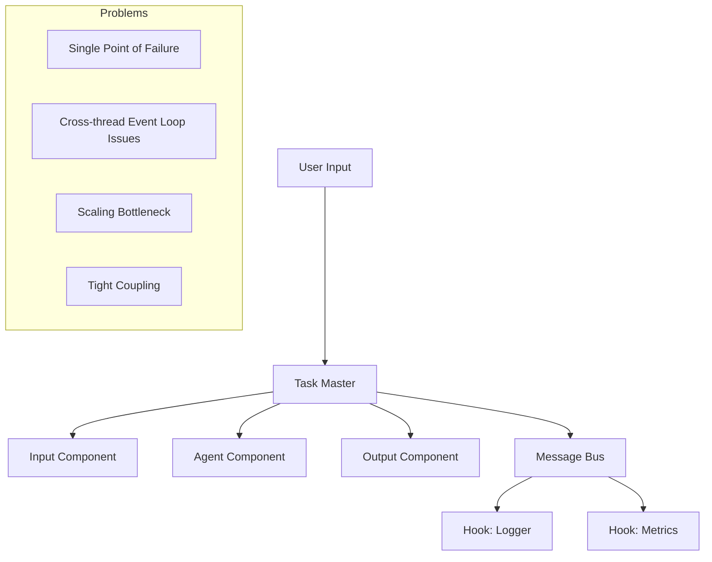
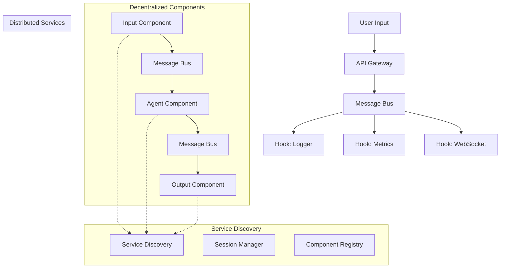

# Technical Design: Decentralized Orchestration (Task Master Elimination)

## Overview

This document defines the technical implementation for eliminating the centralized Task Master and transitioning to a fully decentralized, event-driven orchestration model. This change addresses the core architectural bottleneck and enables true horizontal scaling, component isolation, and elimination of cross-thread event loop issues.

## Requirements

### Functional Requirements
- **FR1**: Eliminate single-point-of-failure Task Master component
- **FR2**: Implement distributed component lifecycle management
- **FR3**: Enable peer-to-peer component communication without central coordinator
- **FR4**: Maintain workflow ordering guarantees (Input → Agent → Output)
- **FR5**: Support session-based component discovery and routing
- **FR6**: Handle component failures gracefully with circuit breakers
- **FR7**: Preserve existing .ww configuration compatibility during transition

### Non-Functional Requirements
- **NFR1**: Zero single points of failure in the orchestration layer
- **NFR2**: <10ms additional latency from decentralized coordination
- **NFR3**: Support independent component scaling without coordinator bottleneck
- **NFR4**: Maintain workflow reliability with distributed failure handling
- **NFR5**: Enable gradual migration from centralized to decentralized approach

## Current vs Target Architecture

### Current Centralized Architecture Issues



### Target Decentralized Architecture



## Detailed Design

### 1. Distributed Component Management

```python
# woodwork/core/distributed/component_manager.py
from typing import Dict, List, Optional, Any, Callable
from dataclasses import dataclass, field
from enum import Enum
import asyncio
import uuid
import time
import logging
from woodwork.core.message_bus import MessageBusAdapter, MessagePattern
from woodwork.types import EventSource

log = logging.getLogger(__name__)

class ComponentState(Enum):
    INITIALIZING = "initializing"
    READY = "ready"
    ACTIVE = "active"
    FAILED = "failed"
    SHUTTING_DOWN = "shutting_down"
    TERMINATED = "terminated"

@dataclass
class ComponentInfo:
    """Component registration and state information"""
    component_id: str
    component_type: str
    state: ComponentState = ComponentState.INITIALIZING
    capabilities: List[str] = field(default_factory=list)
    input_events: List[str] = field(default_factory=list)
    output_events: List[str] = field(default_factory=list)
    resource_requirements: Dict[str, Any] = field(default_factory=dict)
    
    # Runtime information
    last_heartbeat: float = field(default_factory=time.time)
    session_affinity: Optional[str] = None
    process_id: Optional[str] = None
    container_id: Optional[str] = None
    endpoint: Optional[str] = None
    
    # Performance metrics
    avg_processing_time: float = 0.0
    success_rate: float = 1.0
    current_load: int = 0
    max_concurrent: int = 10

class DistributedComponentManager:
    """Manages component lifecycle without central Task Master"""
    
    def __init__(self, message_bus: MessageBusAdapter, component_registry):
        self.message_bus = message_bus
        self.component_registry = component_registry
        
        # Local component state
        self.local_component: Optional[ComponentInfo] = None
        self.known_components: Dict[str, ComponentInfo] = {}
        
        # Lifecycle management
        self.lifecycle_handlers: Dict[ComponentState, List[Callable]] = {
            state: [] for state in ComponentState
        }
        
        # Health monitoring
        self._heartbeat_interval = 30  # seconds
        self._component_timeout = 90   # seconds
        self._heartbeat_task: Optional[asyncio.Task] = None
        
        # Session-based routing
        self.session_workflows: Dict[str, List[str]] = {}  # session_id -> component_chain
        
    async def initialize_component(self, component_config: Dict[str, Any]) -> str:
        """Initialize this process as a distributed component"""
        
        component_id = f"{component_config['type']}_{uuid.uuid4().hex[:8]}"
        
        self.local_component = ComponentInfo(
            component_id=component_id,
            component_type=component_config['type'],
            capabilities=component_config.get('capabilities', []),
            input_events=component_config.get('input_events', []),
            output_events=component_config.get('output_events', []),
            resource_requirements=component_config.get('resources', {}),
            process_id=str(os.getpid()),
            endpoint=component_config.get('endpoint')
        )
        
        # Register with distributed registry
        await self.component_registry.register_component(self.local_component)
        
        # Set up message bus subscriptions
        await self._setup_message_subscriptions()
        
        # Start heartbeat
        self._heartbeat_task = asyncio.create_task(self._heartbeat_loop())
        
        # Set component context for events
        EventSource.set_global_component(component_id, component_config['type'])
        
        log.info(f"Initialized distributed component: {component_id}")
        return component_id
    
    async def _setup_message_subscriptions(self):
        """Set up message bus subscriptions for this component"""
        
        if not self.local_component:
            return
            
        # Subscribe to direct messages for this component
        await self.message_bus.register_component_listener(
            component_id=self.local_component.component_id,
            handler=self._handle_direct_message
        )
        
        # Subscribe to component lifecycle events
        await self.message_bus.register_hook(
            event_pattern="component.*",
            handler=self._handle_component_event,
            component_id=self.local_component.component_id
        )
        
        # Subscribe to session workflow events
        await self.message_bus.register_hook(
            event_pattern="session.*",
            handler=self._handle_session_event,
            component_id=self.local_component.component_id
        )
        
        # Subscribe to input events this component handles
        for event_type in self.local_component.input_events:
            await self.message_bus.register_hook(
                event_pattern=event_type,
                handler=self._handle_workflow_event,
                component_id=self.local_component.component_id
            )
    
    async def _handle_direct_message(self, payload: Dict[str, Any]):
        """Handle direct messages sent to this component"""
        
        message_type = payload.get('type', 'unknown')
        
        if message_type == 'process_request':
            await self._process_workflow_request(payload)
        elif message_type == 'health_check':
            await self._respond_health_check(payload)
        elif message_type == 'shutdown':
            await self._begin_graceful_shutdown()
        else:
            log.warning(f"Unknown direct message type: {message_type}")
    
    async def _handle_component_event(self, payload: Dict[str, Any]):
        """Handle component lifecycle events from other components"""
        
        event_type = payload.get('event_type', '')
        component_info_data = payload.get('component_info', {})
        
        if event_type == 'component.registered':
            component_info = ComponentInfo(**component_info_data)
            self.known_components[component_info.component_id] = component_info
            log.debug(f"Discovered component: {component_info.component_id}")
            
        elif event_type == 'component.failed':
            component_id = component_info_data.get('component_id')
            if component_id in self.known_components:
                self.known_components[component_id].state = ComponentState.FAILED
                await self._handle_component_failure(component_id)
                
        elif event_type == 'component.heartbeat':
            component_id = component_info_data.get('component_id')
            if component_id in self.known_components:
                self.known_components[component_id].last_heartbeat = time.time()
    
    async def _handle_session_event(self, payload: Dict[str, Any]):
        """Handle session-related events for workflow routing"""
        
        event_type = payload.get('event_type', '')
        session_id = payload.get('session_id')
        
        if event_type == 'session.workflow_started':
            # Establish component chain for this session
            workflow_config = payload.get('workflow_config', {})
            component_chain = self._build_component_chain(workflow_config)
            self.session_workflows[session_id] = component_chain
            log.debug(f"Established workflow chain for session {session_id}: {component_chain}")
            
        elif event_type == 'session.ended':
            if session_id in self.session_workflows:
                del self.session_workflows[session_id]
    
    async def _handle_workflow_event(self, payload: Dict[str, Any]):
        """Handle workflow events that this component should process"""
        
        if not self.local_component:
            return
            
        session_id = payload.get('session_id')
        event_type = payload.get('event_type', '')
        
        # Check if this component should handle this event in this session
        if not self._should_process_event(session_id, event_type):
            return
            
        # Update component state
        await self._transition_state(ComponentState.ACTIVE)
        
        try:
            # Process the event (delegate to actual component implementation)
            result = await self._process_component_event(payload)
            
            # Find next component in chain and route result
            await self._route_to_next_component(session_id, result)
            
            # Update success metrics
            self._update_success_metrics(True)
            
        except Exception as e:
            log.error(f"Error processing event: {e}")
            self._update_success_metrics(False)
            
            # Emit error event
            await self.message_bus.emit_event(
                event_type="component.error",
                payload={
                    "component_id": self.local_component.component_id,
                    "session_id": session_id,
                    "error": str(e),
                    "original_event": payload
                },
                session_id=session_id,
                component_source=self.local_component.component_id
            )
        finally:
            await self._transition_state(ComponentState.READY)
    
    def _should_process_event(self, session_id: str, event_type: str) -> bool:
        """Determine if this component should process the event"""
        
        if not self.local_component or not session_id:
            return False
            
        # Check if event type matches what this component handles
        if event_type not in self.local_component.input_events:
            return False
            
        # Check session workflow chain
        if session_id in self.session_workflows:
            chain = self.session_workflows[session_id]
            
            # Simple chain position check - in real implementation would be more sophisticated
            component_types = [comp.component_type for comp in self.known_components.values()]
            if self.local_component.component_type in chain:
                return True
                
        return False
    
    async def _route_to_next_component(self, session_id: str, result: Any):
        """Route processing result to next component in workflow chain"""
        
        if not session_id or session_id not in self.session_workflows:
            return
            
        chain = self.session_workflows[session_id]
        current_type = self.local_component.component_type
        
        try:
            current_index = chain.index(current_type)
            if current_index + 1 < len(chain):
                next_type = chain[current_index + 1]
                
                # Find component of next type that can handle this session
                next_component = self._find_component_for_session(next_type, session_id)
                
                if next_component:
                    await self.message_bus.send_to_component(
                        target_component=next_component.component_id,
                        event_type=f"{current_type}.output",
                        payload={
                            "result": result,
                            "session_id": session_id,
                            "source_component": self.local_component.component_id
                        },
                        session_id=session_id,
                        component_source=self.local_component.component_id
                    )
                else:
                    log.error(f"No component found for type {next_type} in session {session_id}")
        except ValueError:
            log.error(f"Component type {current_type} not found in chain {chain}")
    
    def _find_component_for_session(self, component_type: str, session_id: str) -> Optional[ComponentInfo]:
        """Find best component of given type to handle session"""
        
        candidates = [
            comp for comp in self.known_components.values()
            if comp.component_type == component_type and comp.state == ComponentState.READY
        ]
        
        if not candidates:
            return None
            
        # Simple load balancing - choose component with lowest current load
        return min(candidates, key=lambda c: c.current_load)
    
    def _build_component_chain(self, workflow_config: Dict[str, Any]) -> List[str]:
        """Build component processing chain from workflow configuration"""
        
        # Default chain based on standard workflow
        default_chain = ['input', 'agent', 'output']
        
        # In real implementation, would parse workflow_config to build custom chain
        return workflow_config.get('component_chain', default_chain)
    
    async def _process_component_event(self, payload: Dict[str, Any]) -> Any:
        """Process event using actual component implementation - to be overridden"""
        
        # This is a placeholder - actual components will override this method
        # with their specific processing logic
        log.info(f"Processing event in {self.local_component.component_type}: {payload}")
        
        # Simulate processing time
        await asyncio.sleep(0.1)
        
        return {"processed": True, "component": self.local_component.component_id}
    
    async def _heartbeat_loop(self):
        """Send periodic heartbeats to maintain component registration"""
        
        while self.local_component and self.local_component.state != ComponentState.TERMINATED:
            try:
                await self.component_registry.update_heartbeat(
                    self.local_component.component_id,
                    {
                        "state": self.local_component.state.value,
                        "current_load": self.local_component.current_load,
                        "success_rate": self.local_component.success_rate,
                        "timestamp": time.time()
                    }
                )
                
                # Emit heartbeat event
                await self.message_bus.emit_event(
                    event_type="component.heartbeat",
                    payload={
                        "component_info": {
                            "component_id": self.local_component.component_id,
                            "component_type": self.local_component.component_type,
                            "state": self.local_component.state.value,
                            "current_load": self.local_component.current_load
                        }
                    },
                    session_id="global",
                    component_source=self.local_component.component_id,
                    pattern=MessagePattern.PUB_SUB
                )
                
                await asyncio.sleep(self._heartbeat_interval)
                
            except asyncio.CancelledError:
                break
            except Exception as e:
                log.error(f"Heartbeat failed: {e}")
                await asyncio.sleep(self._heartbeat_interval)
    
    async def _transition_state(self, new_state: ComponentState):
        """Transition component to new state"""
        
        if not self.local_component or self.local_component.state == new_state:
            return
            
        old_state = self.local_component.state
        self.local_component.state = new_state
        
        # Execute state transition handlers
        for handler in self.lifecycle_handlers.get(new_state, []):
            try:
                if asyncio.iscoroutinefunction(handler):
                    await handler(old_state, new_state)
                else:
                    handler(old_state, new_state)
            except Exception as e:
                log.error(f"State transition handler error: {e}")
        
        # Notify other components of state change
        await self.message_bus.emit_event(
            event_type="component.state_changed",
            payload={
                "component_id": self.local_component.component_id,
                "old_state": old_state.value,
                "new_state": new_state.value,
                "timestamp": time.time()
            },
            session_id="global",
            component_source=self.local_component.component_id,
            pattern=MessagePattern.PUB_SUB
        )
        
        log.debug(f"Component {self.local_component.component_id} transitioned: {old_state.value} -> {new_state.value}")
    
    async def _handle_component_failure(self, failed_component_id: str):
        """Handle failure of another component"""
        
        # Remove failed component from known components
        if failed_component_id in self.known_components:
            failed_component = self.known_components[failed_component_id]
            log.warning(f"Component failed: {failed_component_id} ({failed_component.component_type})")
            
            # Update workflows that depend on this component
            await self._update_workflows_for_failure(failed_component)
            
            # Clean up component reference
            del self.known_components[failed_component_id]
    
    async def _update_workflows_for_failure(self, failed_component: ComponentInfo):
        """Update active workflows when a component fails"""
        
        # Find sessions using the failed component
        affected_sessions = []
        for session_id, chain in self.session_workflows.items():
            if failed_component.component_type in chain:
                affected_sessions.append(session_id)
        
        # Attempt to reroute or fail affected sessions
        for session_id in affected_sessions:
            # Try to find replacement component
            replacement = self._find_component_for_session(
                failed_component.component_type, 
                session_id
            )
            
            if replacement:
                log.info(f"Rerouting session {session_id} to replacement component {replacement.component_id}")
            else:
                log.error(f"No replacement found for {failed_component.component_type} in session {session_id}")
                
                # Emit session failure event
                await self.message_bus.emit_event(
                    event_type="session.failed",
                    payload={
                        "session_id": session_id,
                        "reason": f"Component {failed_component.component_id} failed with no replacement",
                        "failed_component": failed_component.component_id
                    },
                    session_id=session_id,
                    component_source=self.local_component.component_id if self.local_component else "unknown"
                )
    
    def _update_success_metrics(self, success: bool):
        """Update component performance metrics"""
        
        if not self.local_component:
            return
            
        # Simple exponential moving average
        alpha = 0.1
        if success:
            self.local_component.success_rate = (
                alpha * 1.0 + (1 - alpha) * self.local_component.success_rate
            )
        else:
            self.local_component.success_rate = (
                alpha * 0.0 + (1 - alpha) * self.local_component.success_rate
            )
    
    async def _begin_graceful_shutdown(self):
        """Begin graceful shutdown of component"""
        
        if not self.local_component:
            return
            
        await self._transition_state(ComponentState.SHUTTING_DOWN)
        
        # Stop accepting new work
        log.info(f"Beginning graceful shutdown of {self.local_component.component_id}")
        
        # Wait for current operations to complete (simplified)
        await asyncio.sleep(1)
        
        # Deregister from registry
        await self.component_registry.deregister_component(self.local_component.component_id)
        
        # Cancel heartbeat
        if self._heartbeat_task:
            self._heartbeat_task.cancel()
        
        await self._transition_state(ComponentState.TERMINATED)
        log.info(f"Component {self.local_component.component_id} shutdown complete")
    
    def register_lifecycle_handler(self, state: ComponentState, handler: Callable):
        """Register handler for component state transitions"""
        self.lifecycle_handlers[state].append(handler)
    
    async def close(self):
        """Cleanup component manager resources"""
        if self.local_component and self.local_component.state != ComponentState.TERMINATED:
            await self._begin_graceful_shutdown()
        
        await self.message_bus.close()
```

### 2. Service Discovery and Component Registry

```python
# woodwork/core/distributed/service_discovery.py
from typing import Dict, List, Optional, Any
import asyncio
import redis.asyncio as redis
import json
import time
import logging
from woodwork.core.distributed.component_manager import ComponentInfo, ComponentState

log = logging.getLogger(__name__)

class DistributedComponentRegistry:
    """Distributed service discovery and component registry"""
    
    def __init__(self, redis_client: redis.Redis):
        self.redis = redis_client
        self.component_ttl = 120  # seconds
        self.cleanup_interval = 60  # seconds
        
        self._cleanup_task: Optional[asyncio.Task] = None
    
    async def initialize(self):
        """Initialize the registry"""
        self._cleanup_task = asyncio.create_task(self._cleanup_expired_components())
        log.info("Component registry initialized")
    
    async def register_component(self, component: ComponentInfo) -> bool:
        """Register a component in the distributed registry"""
        
        try:
            component_key = f"component:{component.component_id}"
            component_data = {
                "component_id": component.component_id,
                "component_type": component.component_type,
                "state": component.state.value,
                "capabilities": component.capabilities,
                "input_events": component.input_events,
                "output_events": component.output_events,
                "resource_requirements": component.resource_requirements,
                "endpoint": component.endpoint,
                "registered_at": time.time(),
                "last_heartbeat": component.last_heartbeat
            }
            
            # Store component info with TTL
            await self.redis.setex(
                component_key,
                self.component_ttl,
                json.dumps(component_data)
            )
            
            # Add to type-based index
            type_key = f"components_by_type:{component.component_type}"
            await self.redis.sadd(type_key, component.component_id)
            await self.redis.expire(type_key, self.component_ttl)
            
            # Add to capability-based index
            for capability in component.capabilities:
                capability_key = f"components_by_capability:{capability}"
                await self.redis.sadd(capability_key, component.component_id)
                await self.redis.expire(capability_key, self.component_ttl)
            
            log.info(f"Registered component: {component.component_id}")
            return True
            
        except Exception as e:
            log.error(f"Failed to register component {component.component_id}: {e}")
            return False
    
    async def deregister_component(self, component_id: str) -> bool:
        """Deregister a component from the registry"""
        
        try:
            # Get component info before deletion
            component_key = f"component:{component_id}"
            component_data = await self.redis.get(component_key)
            
            if component_data:
                component_info = json.loads(component_data)
                
                # Remove from type index
                type_key = f"components_by_type:{component_info['component_type']}"
                await self.redis.srem(type_key, component_id)
                
                # Remove from capability indexes
                for capability in component_info.get('capabilities', []):
                    capability_key = f"components_by_capability:{capability}"
                    await self.redis.srem(capability_key, component_id)
            
            # Delete component record
            await self.redis.delete(component_key)
            
            log.info(f"Deregistered component: {component_id}")
            return True
            
        except Exception as e:
            log.error(f"Failed to deregister component {component_id}: {e}")
            return False
    
    async def update_heartbeat(self, component_id: str, status_update: Dict[str, Any]) -> bool:
        """Update component heartbeat and status"""
        
        try:
            component_key = f"component:{component_id}"
            
            # Check if component exists
            if not await self.redis.exists(component_key):
                log.warning(f"Heartbeat for unknown component: {component_id}")
                return False
            
            # Update component data
            component_data = await self.redis.get(component_key)
            if component_data:
                info = json.loads(component_data)
                info.update(status_update)
                info['last_heartbeat'] = time.time()
                
                # Update with fresh TTL
                await self.redis.setex(
                    component_key,
                    self.component_ttl,
                    json.dumps(info)
                )
                
                return True
            
        except Exception as e:
            log.error(f"Failed to update heartbeat for {component_id}: {e}")
            
        return False
    
    async def discover_components(
        self, 
        component_type: Optional[str] = None,
        capability: Optional[str] = None,
        session_id: Optional[str] = None
    ) -> List[ComponentInfo]:
        """Discover components based on criteria"""
        
        try:
            component_ids = set()
            
            if component_type:
                # Find by type
                type_key = f"components_by_type:{component_type}"
                type_ids = await self.redis.smembers(type_key)
                component_ids.update(id.decode() for id in type_ids)
                
            elif capability:
                # Find by capability
                capability_key = f"components_by_capability:{capability}"
                capability_ids = await self.redis.smembers(capability_key)
                component_ids.update(id.decode() for id in capability_ids)
                
            else:
                # Find all components
                pattern = "component:*"
                keys = await self.redis.keys(pattern)
                component_ids.update(key.decode().split(':', 1)[1] for key in keys)
            
            # Fetch component details
            components = []
            for component_id in component_ids:
                component_key = f"component:{component_id}"
                component_data = await self.redis.get(component_key)
                
                if component_data:
                    info = json.loads(component_data)
                    component = ComponentInfo(
                        component_id=info['component_id'],
                        component_type=info['component_type'],
                        state=ComponentState(info['state']),
                        capabilities=info.get('capabilities', []),
                        input_events=info.get('input_events', []),
                        output_events=info.get('output_events', []),
                        resource_requirements=info.get('resource_requirements', {}),
                        last_heartbeat=info.get('last_heartbeat', 0),
                        endpoint=info.get('endpoint')
                    )
                    components.append(component)
            
            return components
            
        except Exception as e:
            log.error(f"Failed to discover components: {e}")
            return []
    
    async def get_component(self, component_id: str) -> Optional[ComponentInfo]:
        """Get specific component information"""
        
        try:
            component_key = f"component:{component_id}"
            component_data = await self.redis.get(component_key)
            
            if component_data:
                info = json.loads(component_data)
                return ComponentInfo(
                    component_id=info['component_id'],
                    component_type=info['component_type'],
                    state=ComponentState(info['state']),
                    capabilities=info.get('capabilities', []),
                    input_events=info.get('input_events', []),
                    output_events=info.get('output_events', []),
                    resource_requirements=info.get('resource_requirements', {}),
                    last_heartbeat=info.get('last_heartbeat', 0),
                    endpoint=info.get('endpoint')
                )
            
        except Exception as e:
            log.error(f"Failed to get component {component_id}: {e}")
        
        return None
    
    async def _cleanup_expired_components(self):
        """Periodically clean up expired component registrations"""
        
        while True:
            try:
                await asyncio.sleep(self.cleanup_interval)
                
                current_time = time.time()
                expired_components = []
                
                # Find expired components
                pattern = "component:*"
                keys = await self.redis.keys(pattern)
                
                for key in keys:
                    component_data = await self.redis.get(key)
                    if component_data:
                        info = json.loads(component_data)
                        last_heartbeat = info.get('last_heartbeat', 0)
                        
                        if current_time - last_heartbeat > self.component_ttl:
                            component_id = info['component_id']
                            expired_components.append(component_id)
                
                # Clean up expired components
                for component_id in expired_components:
                    log.warning(f"Cleaning up expired component: {component_id}")
                    await self.deregister_component(component_id)
                
                if expired_components:
                    log.info(f"Cleaned up {len(expired_components)} expired components")
                    
            except asyncio.CancelledError:
                break
            except Exception as e:
                log.error(f"Error in component cleanup: {e}")
    
    async def close(self):
        """Cleanup registry resources"""
        if self._cleanup_task:
            self._cleanup_task.cancel()
        await self.redis.close()

class SessionManager:
    """Manages session-based component routing and workflow state"""
    
    def __init__(self, redis_client: redis.Redis):
        self.redis = redis_client
        self.session_ttl = 3600  # 1 hour
    
    async def create_session(self, session_id: str, workflow_config: Dict[str, Any]) -> bool:
        """Create new session with workflow configuration"""
        
        try:
            session_key = f"session:{session_id}"
            session_data = {
                "session_id": session_id,
                "workflow_config": workflow_config,
                "created_at": time.time(),
                "state": "active",
                "component_chain": workflow_config.get('component_chain', ['input', 'agent', 'output'])
            }
            
            await self.redis.setex(
                session_key,
                self.session_ttl,
                json.dumps(session_data)
            )
            
            return True
            
        except Exception as e:
            log.error(f"Failed to create session {session_id}: {e}")
            return False
    
    async def get_session_workflow(self, session_id: str) -> Optional[Dict[str, Any]]:
        """Get workflow configuration for session"""
        
        try:
            session_key = f"session:{session_id}"
            session_data = await self.redis.get(session_key)
            
            if session_data:
                return json.loads(session_data)
                
        except Exception as e:
            log.error(f"Failed to get session {session_id}: {e}")
            
        return None
    
    async def update_session_state(self, session_id: str, state_update: Dict[str, Any]) -> bool:
        """Update session state"""
        
        try:
            session_key = f"session:{session_id}"
            session_data = await self.redis.get(session_key)
            
            if session_data:
                data = json.loads(session_data)
                data.update(state_update)
                data['updated_at'] = time.time()
                
                await self.redis.setex(
                    session_key,
                    self.session_ttl,
                    json.dumps(data)
                )
                return True
                
        except Exception as e:
            log.error(f"Failed to update session {session_id}: {e}")
            
        return False
    
    async def end_session(self, session_id: str) -> bool:
        """End and cleanup session"""
        
        try:
            session_key = f"session:{session_id}"
            await self.redis.delete(session_key)
            return True
            
        except Exception as e:
            log.error(f"Failed to end session {session_id}: {e}")
            return False
```

### 3. Circuit Breaker Pattern for Component Resilience

```python
# woodwork/core/distributed/circuit_breaker.py
from typing import Dict, Callable, Any, Optional
from dataclasses import dataclass
from enum import Enum
import asyncio
import time
import logging

log = logging.getLogger(__name__)

class CircuitState(Enum):
    CLOSED = "closed"      # Normal operation
    OPEN = "open"          # Failing, reject requests
    HALF_OPEN = "half_open" # Testing recovery

@dataclass
class CircuitBreakerConfig:
    failure_threshold: int = 5      # Failures before opening
    recovery_timeout: float = 60    # Seconds before trying recovery
    success_threshold: int = 3      # Successes to close from half-open
    timeout: float = 30             # Request timeout in seconds

class ComponentCircuitBreaker:
    """Circuit breaker for component communication resilience"""
    
    def __init__(self, component_id: str, config: CircuitBreakerConfig):
        self.component_id = component_id
        self.config = config
        
        self.state = CircuitState.CLOSED
        self.failure_count = 0
        self.success_count = 0
        self.last_failure_time = 0
        self.last_request_time = 0
        
        # Fallback handlers
        self.fallback_handlers: Dict[str, Callable] = {}
    
    async def call(self, operation: Callable, *args, **kwargs) -> Any:
        """Execute operation through circuit breaker"""
        
        if not self._can_execute():
            return await self._execute_fallback(operation.__name__, *args, **kwargs)
        
        try:
            # Execute with timeout
            result = await asyncio.wait_for(
                operation(*args, **kwargs),
                timeout=self.config.timeout
            )
            
            await self._record_success()
            return result
            
        except Exception as e:
            await self._record_failure(e)
            return await self._execute_fallback(operation.__name__, *args, **kwargs)
    
    def _can_execute(self) -> bool:
        """Check if operation can be executed"""
        
        self.last_request_time = time.time()
        
        if self.state == CircuitState.CLOSED:
            return True
            
        elif self.state == CircuitState.OPEN:
            # Check if recovery timeout has passed
            if time.time() - self.last_failure_time >= self.config.recovery_timeout:
                self.state = CircuitState.HALF_OPEN
                self.success_count = 0
                log.info(f"Circuit breaker for {self.component_id} moved to HALF_OPEN")
                return True
            return False
            
        elif self.state == CircuitState.HALF_OPEN:
            return True
            
        return False
    
    async def _record_success(self):
        """Record successful operation"""
        
        if self.state == CircuitState.HALF_OPEN:
            self.success_count += 1
            
            if self.success_count >= self.config.success_threshold:
                self.state = CircuitState.CLOSED
                self.failure_count = 0
                log.info(f"Circuit breaker for {self.component_id} CLOSED (recovered)")
                
        elif self.state == CircuitState.CLOSED:
            # Reset failure count on success
            self.failure_count = 0
    
    async def _record_failure(self, error: Exception):
        """Record failed operation"""
        
        self.failure_count += 1
        self.last_failure_time = time.time()
        
        if self.state == CircuitState.CLOSED:
            if self.failure_count >= self.config.failure_threshold:
                self.state = CircuitState.OPEN
                log.warning(f"Circuit breaker for {self.component_id} OPENED due to failures")
                
        elif self.state == CircuitState.HALF_OPEN:
            self.state = CircuitState.OPEN
            log.warning(f"Circuit breaker for {self.component_id} returned to OPEN")
    
    async def _execute_fallback(self, operation_name: str, *args, **kwargs) -> Any:
        """Execute fallback handler if available"""
        
        if operation_name in self.fallback_handlers:
            try:
                fallback = self.fallback_handlers[operation_name]
                return await fallback(*args, **kwargs)
            except Exception as e:
                log.error(f"Fallback handler failed for {operation_name}: {e}")
        
        # Default fallback - return error response
        return {
            "error": "Component unavailable",
            "component_id": self.component_id,
            "circuit_state": self.state.value,
            "timestamp": time.time()
        }
    
    def register_fallback(self, operation_name: str, handler: Callable):
        """Register fallback handler for operation"""
        self.fallback_handlers[operation_name] = handler
    
    def get_stats(self) -> Dict[str, Any]:
        """Get circuit breaker statistics"""
        return {
            "component_id": self.component_id,
            "state": self.state.value,
            "failure_count": self.failure_count,
            "success_count": self.success_count,
            "last_failure_time": self.last_failure_time,
            "last_request_time": self.last_request_time
        }
```

### 4. Integration with Component Base Class

```python
# woodwork/interfaces/component.py (updated)
from typing import Dict, Any, Optional, List, Callable
import asyncio
import logging
from woodwork.core.distributed.component_manager import DistributedComponentManager, ComponentState
from woodwork.core.distributed.circuit_breaker import ComponentCircuitBreaker, CircuitBreakerConfig
from woodwork.core.message_bus import MessageBusAdapter
from woodwork.interfaces.component_base import ComponentBase

log = logging.getLogger(__name__)

class DistributedComponent(ComponentBase):
    """Base class for distributed components without Task Master dependency"""
    
    def __init__(self, name: str, config: Dict[str, Any]):
        super().__init__(name, config)
        
        # Distributed management
        self.component_manager: Optional[DistributedComponentManager] = None
        self.circuit_breakers: Dict[str, ComponentCircuitBreaker] = {}
        
        # Component configuration for distributed mode
        self.distributed_config = {
            'type': self.get_component_type(),
            'capabilities': self.get_capabilities(),
            'input_events': self.get_input_events(),
            'output_events': self.get_output_events(),
            'resources': config.get('resources', {}),
            'endpoint': config.get('endpoint')
        }
    
    async def initialize_distributed(self, message_bus: MessageBusAdapter, component_registry):
        """Initialize component in distributed mode"""
        
        # Create component manager
        self.component_manager = DistributedComponentManager(message_bus, component_registry)
        
        # Initialize as distributed component
        component_id = await self.component_manager.initialize_component(self.distributed_config)
        self.name = component_id  # Update component name to distributed ID
        
        # Register lifecycle handlers
        self.component_manager.register_lifecycle_handler(
            ComponentState.ACTIVE,
            self._on_active
        )
        self.component_manager.register_lifecycle_handler(
            ComponentState.FAILED,
            self._on_failed
        )
        
        # Override component event processing
        self.component_manager._process_component_event = self._process_distributed_event
        
        log.info(f"Initialized distributed component: {component_id}")
    
    async def _process_distributed_event(self, payload: Dict[str, Any]) -> Any:
        """Process event in distributed mode - calls actual component logic"""
        
        try:
            # Extract event data
            event_type = payload.get('event_type', '')
            session_id = payload.get('session_id')
            data = payload.get('data', payload)  # Fallback to full payload
            
            # Route to appropriate component method based on event type
            if hasattr(self, 'process_input') and 'input' in event_type.lower():
                return await self.process_input(data)
            elif hasattr(self, 'process') and 'agent' in event_type.lower():
                return await self.process(data)
            elif hasattr(self, 'process_output') and 'output' in event_type.lower():
                return await self.process_output(data)
            else:
                # Generic processing
                return await self.process(data)
                
        except Exception as e:
            log.error(f"Error in distributed event processing: {e}")
            raise
    
    async def call_component(self, component_type: str, data: Any, session_id: str) -> Any:
        """Call another component with circuit breaker protection"""
        
        # Get or create circuit breaker for target component type
        if component_type not in self.circuit_breakers:
            config = CircuitBreakerConfig()
            self.circuit_breakers[component_type] = ComponentCircuitBreaker(
                component_id=f"{component_type}_circuit", 
                config=config
            )
        
        circuit_breaker = self.circuit_breakers[component_type]
        
        # Execute call through circuit breaker
        async def make_call():
            # Find target component
            components = await self.component_manager.component_registry.discover_components(
                component_type=component_type
            )
            
            if not components:
                raise Exception(f"No components found for type: {component_type}")
            
            # Select best component (simple load balancing)
            target = min(components, key=lambda c: c.current_load)
            
            # Send request
            await self.component_manager.message_bus.send_to_component(
                target_component=target.component_id,
                event_type=f"{self.get_component_type()}.request",
                payload={
                    "data": data,
                    "session_id": session_id,
                    "source_component": self.name
                },
                session_id=session_id,
                component_source=self.name
            )
            
            # Wait for response (simplified - real implementation would use correlation IDs)
            await asyncio.sleep(0.1)  # Placeholder
            return {"success": True}
        
        return await circuit_breaker.call(make_call)
    
    async def _on_active(self, old_state: ComponentState, new_state: ComponentState):
        """Handle component becoming active"""
        log.debug(f"Component {self.name} is now active")
    
    async def _on_failed(self, old_state: ComponentState, new_state: ComponentState):
        """Handle component failure"""
        log.error(f"Component {self.name} has failed")
        
        # Attempt recovery or cleanup
        await self.cleanup()
    
    def get_component_type(self) -> str:
        """Return component type - to be overridden by subclasses"""
        return "generic"
    
    def get_capabilities(self) -> List[str]:
        """Return component capabilities - to be overridden by subclasses"""
        return []
    
    def get_input_events(self) -> List[str]:
        """Return events this component can process - to be overridden by subclasses"""
        return []
    
    def get_output_events(self) -> List[str]:
        """Return events this component can emit - to be overridden by subclasses"""
        return []
    
    async def cleanup(self):
        """Cleanup component resources"""
        if self.component_manager:
            await self.component_manager.close()
        
        await super().cleanup()
```

## Migration Strategy

### Phase 1: Dual-Mode Operation (Weeks 1-2)
- Implement distributed component manager alongside existing Task Master
- Add flag to .ww configuration: `orchestration_mode = "centralized" | "distributed"`  
- Components can run in either mode during transition
- Message bus integration for distributed components

### Phase 2: Component Migration (Weeks 2-4)
- Migrate components one by one to distributed mode
- Update component base classes with distributed capabilities
- Implement service discovery and circuit breaker patterns
- Testing with mixed centralized/distributed deployments

### Phase 3: Task Master Elimination (Weeks 4-5)
- Remove Task Master dependencies from core components
- Update .ww parser to generate distributed deployment configs
- Default new projects to distributed mode
- Legacy support for existing centralized deployments

### Phase 4: Optimization and Hardening (Weeks 5-6)
- Performance optimization of distributed coordination
- Advanced failure recovery and circuit breaker tuning
- Comprehensive monitoring and metrics
- Documentation and migration guides

## Testing Strategy

### Unit Tests
- DistributedComponentManager lifecycle management
- Circuit breaker state transitions and fallback handling
- Service discovery and component registration
- Session-based workflow routing

### Integration Tests
- End-to-end distributed workflow execution
- Component failure and recovery scenarios
- Cross-component communication with message bus
- Distributed deployment with Docker containers

### Chaos Testing
- Random component failures during active workflows
- Network partition simulation between components
- Service discovery failure scenarios
- Circuit breaker behavior under load

## Monitoring and Observability

```python
# Distributed orchestration metrics
class DistributedMetrics:
    # Component Management
    component_registrations = "distributed.component_registrations_total"
    component_failures = "distributed.component_failures_total"
    heartbeat_failures = "distributed.heartbeat_failures_total"
    
    # Workflow Routing
    workflow_routing_time = "distributed.workflow_routing_time_ms"
    session_creation_rate = "distributed.session_creation_rate_per_sec"
    cross_component_calls = "distributed.cross_component_calls_total"
    
    # Circuit Breakers
    circuit_breaker_state = "distributed.circuit_breaker_state"
    circuit_breaker_trips = "distributed.circuit_breaker_trips_total"
    fallback_executions = "distributed.fallback_executions_total"
    
    # Service Discovery
    service_discovery_time = "distributed.service_discovery_time_ms"
    component_discovery_success_rate = "distributed.component_discovery_success_rate"
```

## Key Benefits of Decentralized Approach

1. **Eliminates Single Point of Failure**: No central Task Master to fail
2. **Horizontal Scalability**: Components scale independently based on load
3. **Cross-Thread Issue Resolution**: No event loop conflicts between components
4. **Component Isolation**: Failures contained to individual components
5. **Cloud-Native Architecture**: Aligns with microservices and container orchestration
6. **Improved Observability**: Distributed tracing and component-level metrics
7. **Graceful Degradation**: Circuit breakers provide fallback responses
8. **Session Isolation**: Independent workflows don't interfere with each other

This decentralized approach transforms Woodwork from a monolithic, centrally-orchestrated system into a true distributed, event-driven microservices architecture that can scale horizontally and provide enterprise-level reliability.