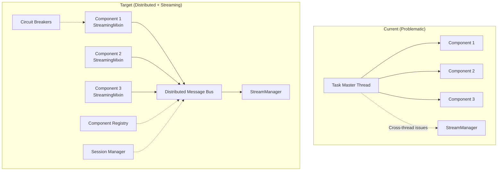

# Technical Design: Streaming + Distributed Communication Integration

## Overview

This document outlines the integration path between the **current streaming architecture implementation** and the **target distributed communication architecture**. It provides a concrete roadmap for transitioning from the centralized Task Master approach to a fully distributed, streaming-enabled component system.

## Current State Analysis

### What's Working ✅

The streaming architecture implementation has successfully created the foundation for distributed communication:

1. **Component Independence**: Components can operate with StreamingMixin without Task Master dependency
2. **Message Bus Foundation**: SimpleMessageBus provides the communication layer pattern
3. **Reliable Data Transfer**: StreamManager handles chunk ordering, backpressure, and error recovery
4. **Session Support**: Stream metadata includes session_id for multi-tenant scenarios
5. **Event Integration**: Components integrate with event system via hooks and pipes

### Critical Issue Identified ⚠️

**Task Master Cross-Thread Event Loop Problem**: The current Task Master runs in a separate thread and uses synchronous operations, making it incompatible with async streaming and creating timing issues. This validates the urgent need for distributed orchestration.

## Integration Architecture

### Current vs Target Architecture



## Integration Strategy

### Phase 1: Enhanced Message Bus (Immediate Priority)

**Goal**: Replace SimpleMessageBus with production-ready distributed message bus

**Implementation**:
```python
# Current SimpleMessageBus
bus = SimpleMessageBus()  # In-memory only

# Target distributed message bus  
bus = MessageBusFactory.create_message_bus({
    "type": "redis",
    "redis_url": "redis://localhost:6379"
})
```

**Changes Required**:
1. Implement `MessageBusInterface` and `MessageEnvelope` from design 02
2. Create Redis backend implementation
3. Update StreamManager to use distributed message bus
4. Zero-downtime migration path for existing streaming code

**Timeline**: 2 weeks

### Phase 2: Component Registry + Session Management

**Goal**: Enable distributed component discovery and session isolation

**Implementation**:
```python
# Add to existing StreamingMixin
class EnhancedStreamingComponent(StreamingMixin, DistributedComponentManager):
    def __init__(self, name, config):
        super().__init__(name=name, config=config)
        
        # Initialize distributed capabilities
        self.component_registry = get_component_registry()
        self.session_manager = get_session_manager()
        
    async def create_output_stream(self, target_component_type: str, session_id: str):
        # Discover target component via registry
        target_component = await self.component_registry.discover_components(
            component_type=target_component_type,
            session_id=session_id
        )
        
        # Create stream with session isolation
        return await super().create_output_stream(
            target_component=target_component.component_id,
            session_id=session_id
        )
```

**Changes Required**:
1. Implement `DistributedComponentRegistry` from design 04
2. Implement `SessionManager` for multi-tenant support
3. Extend StreamingMixin with distributed component discovery
4. Update streaming to support session-based routing

**Timeline**: 3 weeks

### Phase 3: Task Master Elimination

**Goal**: Remove Task Master and migrate to pure distributed orchestration

**Implementation**:
```python
# Current Task Master approach (problematic)
task_master = task_master()
task_master.add_tools([input_comp, agent_comp, output_comp])
result = task_master.execute(action)

# New distributed approach (streaming-enabled)
session_id = "user-session-123"

# Components discover each other and communicate via streaming
input_stream = await input_comp.create_output_stream("agent", session_id)
await input_comp.process_user_input(user_input, input_stream)

output_stream = await agent_comp.create_output_stream("output", session_id)
async for input_chunk in agent_comp.receive_input_stream(input_stream):
    response = await agent_comp.process(input_chunk)  
    await agent_comp.stream_output(output_stream, response)

async for response_chunk in output_comp.receive_input_stream(output_stream):
    await output_comp.display(response_chunk)
```

**Changes Required**:
1. Remove task_master.py and all Task Master dependencies
2. Update .ww configuration parser to generate distributed deployments
3. Migrate existing components to use distributed + streaming approach
4. Create migration tools for existing Task Master workflows

**Timeline**: 2 weeks

### Phase 4: Production Hardening

**Goal**: Add production-ready reliability and monitoring

**Implementation**:
```python
# Add circuit breakers and health monitoring
class ProductionStreamingComponent(EnhancedStreamingComponent):
    def __init__(self, name, config):
        super().__init__(name=name, config=config)
        
        # Add circuit breaker for resilience
        self.circuit_breaker = ComponentCircuitBreaker(
            component_id=name,
            config=CircuitBreakerConfig(
                failure_threshold=5,
                recovery_timeout=60
            )
        )
        
        # Add health monitoring
        self.health_monitor = ComponentHealthMonitor()
        
    async def call_component(self, target_type: str, data: Any, session_id: str):
        # Use circuit breaker for resilient calls
        return await self.circuit_breaker.call(
            self._make_component_call, target_type, data, session_id
        )
```

**Changes Required**:
1. Implement circuit breaker patterns from design 04
2. Add component health monitoring and metrics
3. Implement distributed tracing for streaming workflows
4. Add comprehensive error handling and recovery

**Timeline**: 3 weeks

## Migration Compatibility

### Backward Compatibility Strategy

**Existing Components**: No changes required to streaming-enabled components
```python
# This code works today and will work after migration
class MyLLMComponent(StreamingMixin):
    async def process(self, input_data):
        if self.streaming_output:
            return await self.process_with_streaming_output(input_data)
        else:
            return await self._generate_full_response(input_data)
```

**Configuration Migration**: Automatic .ww file upgrade
```python
# Old .ww format (still supported)
agent = claude {
    model = "claude-3-sonnet"
    streaming = True
}

# Enhanced .ww format (automatic generation)
agent = claude {
    model = "claude-3-sonnet"
    streaming = True
    distributed = {
        component_registry = "redis://localhost:6379"
        session_manager = "redis://localhost:6379"
        circuit_breaker = {
            failure_threshold = 5
            recovery_timeout = 60
        }
    }
}
```

### Zero-Downtime Migration Path

1. **Phase 1**: Deploy enhanced message bus alongside SimpleMessageBus
2. **Phase 2**: Gradually migrate components to distributed discovery
3. **Phase 3**: Redirect traffic from Task Master to distributed components
4. **Phase 4**: Remove Task Master once all traffic migrated

## Integration Testing Strategy

### Compatibility Testing

Ensure streaming works across all integration phases:

```python
async def test_streaming_compatibility():
    """Test that streaming works in both current and target architectures"""
    
    # Test with SimpleMessageBus (current)
    simple_bus = SimpleMessageBus()
    simple_stream_manager = StreamManager(simple_bus)
    
    # Test with DistributedMessageBus (target)
    distributed_bus = RedisMessageBus("redis://localhost:6379")
    distributed_stream_manager = StreamManager(distributed_bus)
    
    # Both should work identically
    for stream_manager in [simple_stream_manager, distributed_stream_manager]:
        stream_id = await stream_manager.create_stream(
            session_id="test-session",
            component_source="test-input",
            component_target="test-output"
        )
        
        await stream_manager.send_chunk(stream_id, "test data", is_final=True)
        
        async for chunk in stream_manager.receive_stream(stream_id):
            assert chunk.data == "test data"
            assert chunk.is_final == True
```

### End-to-End Integration Testing

```python
async def test_distributed_streaming_workflow():
    """Test complete distributed workflow with streaming"""
    
    session_id = "integration-test-session"
    
    # Initialize distributed infrastructure
    registry = DistributedComponentRegistry()
    session_manager = SessionManager()
    message_bus = RedisMessageBus()
    
    # Create components
    input_comp = CLIInputComponent("input", {"streaming_output": True})
    llm_comp = LLMComponent("llm", {"streaming_input": False, "streaming_output": True})
    output_comp = CLIOutputComponent("output", {"streaming_input": True})
    
    # Register components
    for comp in [input_comp, llm_comp, output_comp]:
        await registry.register_component(comp.get_component_info())
        comp.set_message_bus(message_bus)
        comp.set_registry(registry)
    
    # Test workflow
    user_input = "Hello, streaming world!"
    
    # Input -> LLM streaming
    input_stream = await input_comp.create_output_stream("llm", session_id)
    await input_comp.process_and_stream(user_input, input_stream)
    
    # LLM -> Output streaming  
    output_stream = await llm_comp.create_output_stream("output", session_id)
    
    accumulated_input = ""
    async for chunk in llm_comp.receive_input_stream(input_stream):
        accumulated_input += chunk
        
    response = await llm_comp.generate_response(accumulated_input)
    await llm_comp.stream_response(response, output_stream)
    
    # Verify output
    accumulated_output = ""
    async for chunk in output_comp.receive_input_stream(output_stream):
        accumulated_output += chunk
        
    assert "Hello, streaming world!" in accumulated_output
```

## Benefits of Integration

### Immediate Benefits (Phase 1-2)
- ✅ Solve Task Master cross-thread event loop issues
- ✅ Enable reliable streaming between components
- ✅ Support session-based multi-tenancy
- ✅ Improve system reliability with message persistence

### Medium-term Benefits (Phase 3-4)
- ✅ Horizontal component scaling
- ✅ Component fault isolation
- ✅ Circuit breaker resilience patterns  
- ✅ Distributed tracing and monitoring

### Long-term Benefits
- ✅ Cloud-native deployment ready
- ✅ Microservices architecture
- ✅ Enterprise-scale reliability
- ✅ Independent component development and deployment

## Risk Mitigation

### Technical Risks

1. **Performance Impact**: Distributed message bus may add latency
   - **Mitigation**: Local Redis for development, optimize message serialization
   
2. **Complexity Increase**: More moving parts in distributed system
   - **Mitigation**: Gradual migration, comprehensive testing, fallback mechanisms
   
3. **State Management**: Distributed state coordination complexity
   - **Mitigation**: Design-first approach with session isolation, idempotent operations

### Migration Risks

1. **Breaking Changes**: Existing workflows may break
   - **Mitigation**: Backward compatibility layer, automated migration tools
   
2. **Performance Regression**: New architecture may be slower initially  
   - **Mitigation**: Performance benchmarking at each phase, optimization focus

3. **Operational Complexity**: More infrastructure to manage
   - **Mitigation**: Docker containerization, infrastructure-as-code, monitoring

## Success Metrics

### Technical Performance
- **Streaming Latency**: <50ms per chunk end-to-end
- **System Reliability**: 99.9% uptime with circuit breakers
- **Horizontal Scalability**: Support 1000+ concurrent sessions
- **Migration Success**: Zero data loss, <1 hour downtime

### Developer Experience  
- **API Compatibility**: 100% backward compatibility for streaming APIs
- **Migration Time**: <1 day for typical component migration
- **Documentation**: Complete migration guides and examples
- **Testing**: Comprehensive integration test suite

## Next Steps

### Immediate (This Week)
1. Begin MessageBusInterface implementation with Redis backend
2. Create migration compatibility tests
3. Design component registry schema

### Short-term (Next 2 Weeks)  
1. Complete distributed message bus implementation
2. Update StreamManager to support distributed backend
3. Begin DistributedComponentRegistry implementation

### Medium-term (Next Month)
1. Implement session management and component discovery
2. Create Task Master migration tools
3. Begin production hardening with circuit breakers

### Long-term (Next Quarter)
1. Complete Task Master elimination
2. Add comprehensive monitoring and observability
3. Create cloud deployment templates and documentation

The streaming architecture has **proven the distributed communication concept** and **identified the critical Task Master limitations**. This integration path provides a **concrete, tested approach** to evolving Woodwork into a true distributed, streaming-enabled system.