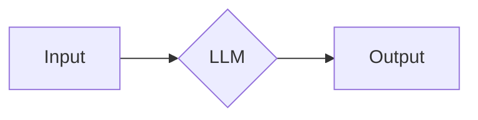
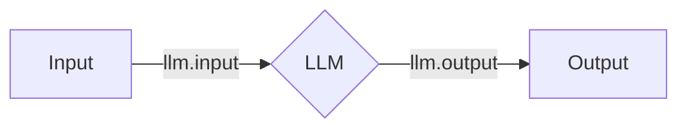

# Tutorial: Adding Memory

Now that we have our basic agent defined, you might notice that a key property of a Q&A agent is missing - it is not able to remember previous interactions!

To fix this, we will need to keep track of the messages sent by the user and by the model, and prepend them to the next prompt sent to the model.

When thinking about this system, each component is connected as shown below, and then looped through each conversation turn:



In Woodwork, there exists the concept of events, analagous to middleware in other AI Agent frameworks, in which you can use as triggers for executing code. Lucky for us, each component outputs an `input` and `output` event.



We can then declaratively add code to run on these events, using concepts called `hooks` and `pipes`.

`hooks` are read-only, and as such can be run in parallel. `pipes` can modify the data at an event, and as such are run in sequence.

Now, bringing this back to our example, we want to add previous context before the model, and we want to update the context after every turn. This means we have to add two `pipes`, one at `llm.input` and one at `llm.output`.

`hooks` and `pipes` run code at the event. Below is some python code I have written to write and read from the context in a text file:

```python
```

Then, in our config file, all we have to do is add them as `pipes` to the correct event!

```woodwork
```

If we run the `woodwork --init`, then `woodwork`, we can see that the simple Q&A agent is now able to remember conversation history!

## Closing Remarks

I know these concepts might seem confusing at first, but trust me its worth it to spend some time becoming familiar with them! Context-engineering is a popular term at the moment, and can often become super tricky and messy. This abstraction makes it much easier to handle context in an organised and maintainable way, and is the key to building production systems.

Of course, short term memory is something super common, so defining this each time would become a bit of a pain. As such, we have defined an attribute for the `llm` component to make this easier to implement!

```woodwork
```

A lot of what you see in woodwork will be built on hooks and pipes, and as such we will have quick ways to do common things.

The necessity of hooks and pipes are something you can read about [here](#).

Now, onto the next challenge where we will be looking into giving our agent access to tools!
